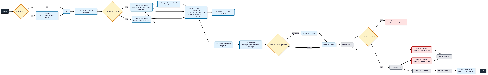
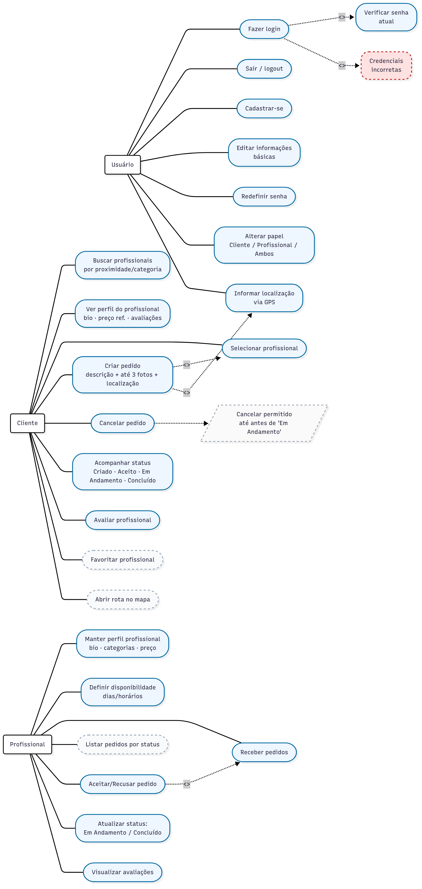
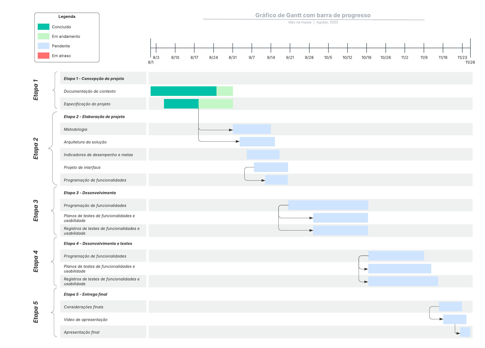
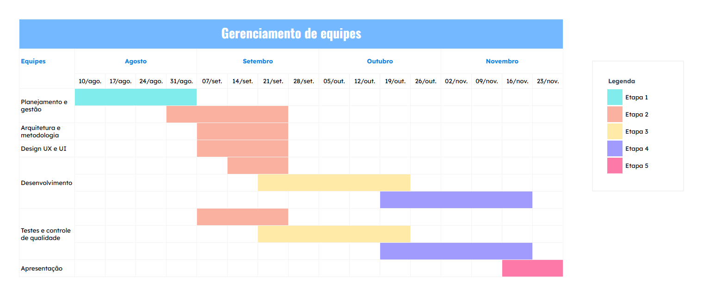
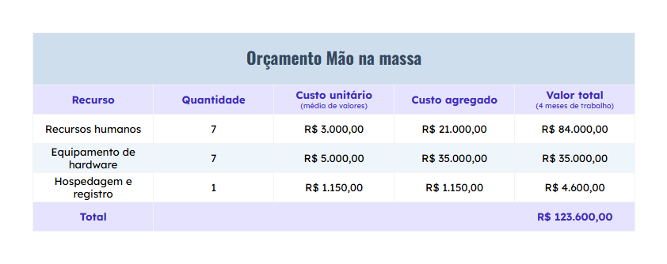

# Especificações do Projeto

Nesta seção será descrito em detalhes o que o sistema deve fazer e como deve se comportar. Nela ficam registrados:

- Requisitos Funcionais → tudo que o app precisa oferecer (ex.: cadastro de usuários, criação de pedidos, avaliação de profissionais).
- Requisitos Não Funcionais → características técnicas que garantem qualidade (ex.: desempenho, segurança, usabilidade, LGPD).
- Histórias de Usuário → narrativas que mostram como cada funcionalidade será utilizada no dia a dia.
- Modelagem do Sistema → diagramas, casos de uso, classes e fluxos que explicam tecnicamente como as funções serão implementadas.

Resumidamente, será abordada e transformada a visão geral do projeto Mão na Massa em um guia detalhado de implementação, servindo tanto para orientar o desenvolvimento da equipe quanto para documentar claramente as decisões técnicas e funcionais do app.

---

## Personas

### Maria de Lourdes, 56 anos — dona de casa

#### Perfil
Usa o celular principalmente para WhatsApp. Mora em cidade pequena e nunca contratou serviços por aplicativo. Preza por simplicidade e segurança.

#### Objetivos e tarefas
Encontrar rapidamente um profissional de confiança para pequenos reparos e acompanhar o andamento do serviço.

#### Dores
Medo de golpes, insegurança em compartilhar dados e dificuldade em comparar opções.

#### Como o MVP atende

- Listagem de profissionais próximos com perfil, avaliações e categorias.
- Seleção obrigatória do profissional antes de criar o pedido (evita disparos genéricos).
- Criação do pedido com descrição + fotos (câmera/galeria) e acompanhamento de status (Criado → Aceito → Em Andamento → Concluído / Cancelado).
- Notificações locais e pull-to-refresh para ver atualizações quando o app está aberto.
- LGPD básico e linguagem simples nas permissões (localização, câmera/galeria).

#### Evoluções futuras (fora do MVP)

- Pagamentos no app;
- chat em tempo real.

### João Pedro, 32 anos — analista de marketing

#### Perfil
Usuário frequente de apps de delivery e bancos digitais. Valoriza praticidade e feedback rápido.

#### Objetivos e tarefas
Comparar opções, abrir rota até o local do serviço se necessário, recontratar quem já deu certo.

#### Dores
Respostas lentas e insegurança com profissionais desconhecidos.

#### Como o MVP atende

- Filtros por categoria e ordenar por proximidade (com permissão de localização).
- Abrir rotas via app de mapas do telefone (deep link).
- Favoritar profissionais para recontratar com um toque (se habilitado no MVP como Could).
- Avaliar ao final, fortalecendo reputação.

#### Evoluções futuras (fora do MVP)

- PIX/checkout in-app;
- push externo (FCM).

### Ana Paula, 28 anos — diarista autônoma (Profissional)

#### Perfil
Capta clientes por WhatsApp e redes sociais. Quer visibilidade e organização da agenda.

#### Objetivos e tarefas
Ter um perfil claro (bio, categorias, preço de referência, fotos), gerir disponibilidade e consolidar avaliações.

#### Dores
Cancelamentos de última hora, horários sobrecarregados e pouca prova social.

#### Como o MVP atende

- Perfil do profissional com categorias, bio e portfólio de fotos (básico).
- Agenda: cadastro de dias/horários trabalhados; clientes podem filtrar por disponibilidade (opcional no MVP).
- Avaliações pós-serviço para reputação.
- Histórico resumido (quantidade de serviços concluídos e média).

#### Evoluções futuras (fora do MVP)

- Gestão de pagamentos/repasse;
- chat em tempo real.

### Carlos Henrique, 41 anos — empresário de manutenção predial

#### Perfil
Administra pequena equipe. Precisa de organização e visibilidade dos serviços.

#### Objetivos e tarefas
Centralizar pedidos, acompanhar status e expor portfólio/avaliações da empresa.

#### Dores
Informação dispersa e dificuldade em comprovar qualidade.

#### Como o MVP atende

- Conta de profissional (representando o responsável) com perfil e portfólio.
- Acompanhamento de pedidos por status, do aceite à conclusão.
- Avaliações para evidenciar credibilidade.

#### Evoluções futuras (fora do MVP)

- Multiusuário/equipe, relatórios gerenciais e integrações de pagamento.

### Fernanda Alves, 38 anos — gestora de condomínio (Cliente recorrente)

#### Perfil
Contrata manutenção e limpeza para vários prédios. Precisa de confiabilidade e agilidade.

#### Objetivos e tarefas
Manter lista de profissionais de confiança, recontratar rapidamente, acompanhar histórico.

#### Dores
Tempo gasto negociando e falta de histórico centralizado.

#### Como o MVP atende

- Favoritos para recontratação rápida (Could do MVP).
- Histórico de pedidos com status e avaliações.
- Seleção direta do profissional e criação de pedido vinculado.

#### Evoluções futuras (fora do MVP)

- Múltiplos agendamentos em lote;
- relatórios exportáveis;
- push externo. 

---

## Histórias de Usuário

|                                      **EU COMO... PERSONA**                                     |                           **QUERO/PRECISO... FUNCIONALIDADE**                          |                             **PARA... MOTIVO/VALOR**                             |
|:-----------------------------------------------------------------------------------------------:|:--------------------------------------------------------------------------------------:|:--------------------------------------------------------------------------------:|
|                      Cliente — Maria de Lourdes; João Pedro; Fernanda Alves                     |                     Cadastrar-me com nome, e-mail/telefone e senha                     |                     Acessar o aplicativo e usar seus recursos                    |
|                      Cliente — Maria de Lourdes; João Pedro; Fernanda Alves                     |                                Fazer login no aplicativo                               |                      Retomar o uso e gerenciar meus pedidos                      |
|                      Cliente — Maria de Lourdes; João Pedro; Fernanda Alves                     |                    Editar meu perfil (nome, foto, telefone, e-mail)                    |                           Manter meus dados atualizados                          |
| Cliente/Profissional — Maria de Lourdes; João Pedro; Fernanda Alves; Ana Paula; Carlos Henrique |                  Selecionar meu papel (Cliente, Profissional ou Ambos)                 |                    Usar o app de acordo com minha necessidade                    |
|                      Cliente — Maria de Lourdes; João Pedro; Fernanda Alves                     |                         Autorizar (ou não) o uso da localização                        | Receber resultados por proximidade e entender o que muda se eu negar a permissão |
|                      Cliente — Maria de Lourdes; João Pedro; Fernanda Alves                     |                  Buscar profissionais próximos e filtrar por categoria                 |                  Encontrar rapidamente quem resolve meu serviço                  |
|                      Cliente — Maria de Lourdes; João Pedro; Fernanda Alves                     |               Selecionar um profissional da lista antes de criar o pedido              |             Direcionar meu pedido a quem eu realmente quero contratar            |
|                      Cliente — Maria de Lourdes; João Pedro; Fernanda Alves                     |        Criar um pedido com descrição, até 3 fotos (câmera/galeria) e localização       |                      Registrar claramente minha necessidade                      |
|                      Cliente — Maria de Lourdes; João Pedro; Fernanda Alves                     | Acompanhar o status do pedido (Criado → Aceito → Em Andamento → Concluído / Cancelado) |                     Saber em que etapa está cada solicitação                     |
|                      Cliente — Maria de Lourdes; João Pedro; Fernanda Alves                     |                 Cancelar um pedido antes de ser iniciado (Em Andamento)                |                      Evitar agendamentos que não vou cumprir                     |
|                               Cliente — João Pedro; Fernanda Alves                              |                    Abrir rota no app de mapas do celular (deep link)                   |              Chegar facilmente ao local do serviço quando necessário             |
|                      Cliente — Maria de Lourdes; João Pedro; Fernanda Alves                     |           Receber notificações locais/alertas no app sobre mudanças de status          |             Acompanhar a evolução do pedido quando estou usando o app            |
|                               Cliente — João Pedro; Fernanda Alves                              |                          Adicionar profissionais aos favoritos                         |                       Recontratá-los mais facilmente depois                      |
|                               Cliente — João Pedro; Fernanda Alves                              |               Filtrar por disponibilidade (dias/horários do profissional)              |                      Solicitar serviços em momentos viáveis                      |
|              Cliente (ao ver perfil) — Maria de Lourdes; João Pedro; Fernanda Alves             |  Visualizar histórico resumido (serviços concluídos, média de avaliações) e portfólio  |        Tomar decisões com base em experiência real e trabalhos anteriores        |
|                            Profissional — Ana Paula; Carlos Henrique                            |            Criar e editar meu perfil (bio, categorias, preço de referência)            |                   Expor minhas qualificações e atrair clientes                   |
|                            Profissional — Ana Paula; Carlos Henrique                            |                 Cadastrar meus dias e horários de atendimento (agenda)                 |                Organizar minha disponibilidade e evitar sobrecarga               |
|                            Profissional — Ana Paula; Carlos Henrique                            |                           Receber pedidos direcionados a mim                           |                             Conseguir novos trabalhos                            |
|                            Profissional — Ana Paula; Carlos Henrique                            |                               Aceitar ou recusar pedidos                               |                 Controlar minha agenda e qualidade do atendimento                |
|                            Profissional — Ana Paula; Carlos Henrique                            |                  Atualizar o status para “Em Andamento” e “Concluído”                  |                  Manter o cliente informado e organizar o fluxo                  |
|                            Profissional — Ana Paula; Carlos Henrique                            |             Consultar a lista de pedidos recebidos (com filtros por status)            |                       Ter controle sobre meus atendimentos                       |
|                            Profissional — Ana Paula; Carlos Henrique                            |                    Cadastrar fotos de portfólio fixas no meu perfil                    |                Mostrar trabalhos anteriores e ganhar credibilidade               |
| Cliente/Profissional — Maria de Lourdes; João Pedro; Fernanda Alves; Ana Paula; Carlos Henrique |                   Alternar entre os papéis de Cliente e Profissional                   |                       Utilizar o sistema de forma flexível                       |

---

## Modelagem do Processo de Negócio

### Análise da Situação Atual

O cenário atual de contratação de profissionais autônomos em cidades pequenas e áreas rurais apresenta dificuldades que justificam o Mão na Massa:

- Confiança: contratações informais por indicação/redes sociais, sem reputação estruturada e com receio de golpes.
- Comunicação dispersa: tratativas por telefone/WhatsApp, sem registro de status ou histórico confiável.
- Agendamento frágil: agendas pessoais e combinados verbais, gerando choque de horários e cancelamentos.
- Visibilidade limitada do profissional: dificuldade de divulgar serviços para além da rede de contatos.
- Ausência de trilha de serviço: falta de um fluxo claro de criação → aceite → execução → conclusão e avaliação.

### Descrição Geral da Proposta

O Mão na Massa é um aplicativo móvel que centraliza a contratação de serviços locais com foco em simplicidade, transparência e controle do fluxo de atendimento.

#### Limites da Proposta (MVP)

- Plataforma: app Android (React Native + Expo).
- Back-end: API REST leve (agnóstica de tecnologia) para autenticação, perfis, profissionais, pedidos e avaliações.
- Funcionalidades-chave:

  - Autenticação tradicional (e-mail/telefone + senha) e seleção de papel (Cliente, Profissional ou Ambos).
  - Busca por proximidade (com permissão de localização) e filtro por categoria.
  - Seleção obrigatória do profissional antes de criar o pedido.
  - Criação do pedido com descrição, até 3 fotos (câmera/galeria) e localização.
  - Acompanhamento de status: Criado → Aceito → Em Andamento → Concluído (e Cancelado quando aplicável).
  - Agenda do profissional (dias/horários). Filtro por disponibilidade é opcional (Could) no MVP.
  - Avaliação (nota 1–5 + comentário) ao concluir.
  - Notificações locais (no app) e pull/auto-refresh para atualização — sem push externo.
  - Abrir rota no app de mapas do dispositivo (deep link).

### Ligações com as Estratégias e Objetivos do Negócio

- Segurança e confiança: perfis claros, avaliações públicas, consentimento e LGPD básico; tokens guardados com segurança; tráfego sob TLS.
- Eficiência operacional: um único fluxo para buscar, selecionar profissional, criar e acompanhar pedidos; agenda reduz cancelamentos e sobrecarga.
- Acessibilidade: experiência mobile-first com textos escaláveis e mensagens claras de permissão (localização/câmera).
- Valorização do profissional: portfólio, avaliações e histórico resumido aumentam credibilidade e geração de demanda local.
- Escalabilidade: arquitetura simples (mobile + API) que permite evoluções futuras (pagamentos, push, chat, relatórios).

### Oportunidades de Melhoria (com o MVP)

- Reduzir informalidade com cadastro, trilha de status e avaliações.
- Diminuir ruídos de comunicação com um histórico de cada pedido dentro do app.
- Melhor alocação de agenda do profissional com definição de dias/horários e (opcional) filtro por disponibilidade.
- Acessos geográficos: ordenar por proximidade e abrir rotas em mapas.
- Recontratação mais rápida via favoritos (Could).

### Processo 1 – Cliente

#### Objetivo

Permitir que o Cliente encontre um Profissional próximo, selecione quem deseja, crie um pedido vinculado e acompanhe a execução até a conclusão e avaliação.

#### Fluxo principal (BPMN textual)

1. Abrir app / Autenticar (ou cadastrar-se).
2. Permissão de Localização
2.1. Aceita → habilita ordenar por proximidade.
2.2. Negada → segue com busca por categoria, sem proximidade (app explica o impacto).
3. Buscar profissionais: listar por proximidade (se 2.1) e filtrar por categoria.
4. Visualizar perfil do profissional (bio, categorias, preço de referência, fotos/portfólio, média e quantidade de avaliações, histórico resumido).
5. Selecionar profissional (obrigatório).
6. Criar pedido (formulário): descrição, até 3 fotos (câmera/galeria), localização.
7. Enviar pedido → status: Criado.
8. Acompanhar status (pull/auto-refresh e notificações locais enquanto o app está ativo):
- Criado → Aceito → Em Andamento → Concluído (ou Cancelado).
9. Cancelar pedido (permitido antes de “Em Andamento”).
10. Concluir e Avaliar (nota 1–5 + comentário).
11. (Opcional) Favoritar profissional para recontratar depois.

#### Regras de negócio

- RB-C1: É obrigatório selecionar um profissional antes de criar o pedido.
- RB-C2: Máx. 3 fotos por pedido (compressão no cliente).
- RB-C3: Cancelamento permitido apenas até status “Criado” (ou “Aceito”, conforme política definida) — nunca após “Em Andamento”.
- RB-C4: Sem chat in-app; dados de contato podem estar no perfil (uso opcional pelo cliente, fora do escopo do app).
- RB-C5: Sem pagamentos in-app no MVP.

#### Exceções e caminhos alternativos

- Permissão negada: sem proximidade; busca funciona por categoria.
- Falha de rede: app orienta a tentar novamente; manter idempotência ao reenviar.
- Profissional indisponível: cliente pode voltar à lista e escolher outro.

### Processo 2 — Profissional (Gestão de Atendimentos)

#### Objetivo

Permitir que o Profissional mantenha seu perfil e agenda, receba pedidos dirigidos a ele, aceite/recuse, atualize status e acompanhe avaliações.

#### Fluxo principal (BPMN textual)

1. Autenticar-se e selecionar papel Profissional (ou Ambos).
2. Configurar Perfil: bio, categorias, preço de referência, fotos/portfólio.
3. Definir Agenda: dias/horários trabalhados (disponibilidade).
4. Receber pedidos direcionados (lista com filtros por status).
5. Aceitar ou Recusar:
5.1 Aceitar → pedido passa a Aceito.
5.2 Recusar → cliente é informado e pode escolher outro profissional.
6. Atualizar status: Em Andamento ao iniciar; Concluído ao finalizar.
7. Consultar histórico e avaliações (para reputação).

#### Regras de negócio

- RB-P1: Agenda influencia a expectativa do cliente; filtro por disponibilidade pode ser oferecido (Could).
- RB-P2: Atualização de status é obrigatória para refletir andamento e permitir avaliação.
- RB-P3: Não há repasse/pagamento pelo app no MVP.

#### Exceções e caminhos alternativos

- Sobrecarga/fora de horário: profissional pode recusar mantendo reputação (evita “aceitar e não cumprir”).
- Indisponibilidade momentânea de rede: manter idempotência na atualização de status.

---

## Indicadores de Desempenho

### KPIs de Negócio (MVP)

|                     **Indicador**                     |                  **Objetivos**                 |                            **Descrição**                           |                           **Cálculo (por período)**                           |     **Fonte de dados**    |      **Perspectiva**      |
|:-----------------------------------------------------:|:----------------------------------------------:|:------------------------------------------------------------------:|:-----------------------------------------------------------------------------:|:-------------------------:|:-------------------------:|
|             Taxa de Conclusão de Serviços             | Avaliar a eficiência no fechamento dos pedidos |    Percentual de pedidos Concluídos entre os Criados no período    |   (Qtd. Request com status Concluído ÷ Qtd. Request Criado no período) × 100  |          Request          |     Processos Internos    |
|                Tempo Médio de Resposta                |         Monitorar a agilidade do aceite        |            Tempo médio entre Criação e Aceite do pedido            |                Σ(DataAceite − DataCriacao) ÷ # pedidos Aceitos                |          Request          |          Clientes         |
|             Taxa de Avaliações Registradas            |          Garantir qualidade e feedback         |     Percentual de Concluídos que receberam ao menos 1 avaliação    |       (Qtd. Review de pedidos Concluídos ÷ Qtd. Request Concluído) × 100      |      Review, Request      | Aprendizado & Crescimento |
|             Utilização da Disponibilidade             |  Verificar aderência à agenda do profissional  | Percentual de pedidos criados dentro dos dias/horários cadastrados |  (Qtd. Request compatíveis com AvailabilitySlot ÷ Qtd. Request Criado) × 100  | AvailabilitySlot, Request |     Processos Internos    |
|              Taxa de Repetição de Cliente             |                Medir fidelização               |      Proporção de clientes que fizeram ≥ 2 pedidos no período      |    (Qtd. User com ≥2 Request no período ÷ Qtd. User que criou pedido) × 100   |       User, Request       |          Clientes         |
| Uso de Profissionais Favoritos (se habilitado no MVP) |         Medir engajamento com favoritos        |    Percentual de pedidos criados a partir de favorite do cliente   | (Qtd. Request cujo professionalId ∈ Favorite do cliente ÷ Qtd. Request) × 100 |     Favorite, Request     | Aprendizado & Crescimento |

### KPIs Técnicos (RNF — Mobile)

| Indicador                                             | Objetivos                     | Descrição                                                                        | Cálculo (por período)                         | Fonte de dados                     | Perspectiva               |
| ----------------------------------------------------- | ----------------------------- | -------------------------------------------------------------------------------- | --------------------------------------------- | ---------------------------------- | ------------------------- |
| **Tempo até a Home (TTI)**                            | Garantir desempenho percebido | Tempo médio do **launch** até a **primeira renderização útil** da Home           | Média dos tempos por sessão (ms)              | Telemetria do app / medição manual | Processos Internos        |
| **Tamanho do APK**                                    | Controlar footprint do app    | Tamanho do artefato de distribuição Android                                      | Medida do artefato (MB)                       | Pipeline de build (EAS/CI)         | Processos Internos        |
| **Sessões sem Crash**                                 | Garantir estabilidade         | Percentual de sessões **sem falhas**                                             | (Sessões sem crash ÷ Total de sessões) × 100  | Telemetria do app                  | Processos Internos        |
| **Latência média da API (Listagem de Profissionais)** | Assegurar fluidez da lista    | Tempo médio de resposta dos endpoints de **listagem/filtro**                     | Σ tempo de resposta ÷ # requisições           | Logs do back-end / métricas no app | Processos Internos        |
| **Aceite de Permissão de Localização**                | Medir impacto da proximidade  | Percentual de prompts de localização **concedidos**                              | (Prompts concedidos ÷ Prompts exibidos) × 100 | Telemetria do app                  | Clientes                  |
| **Consumo médio de dados por sessão**                 | Proteger franquia de dados    | Bytes médios baixados por sessão                                                 | Σ bytes transferidos ÷ # sessões              | Telemetria do app                  | Clientes                  |
| **Cobertura de Acessibilidade básica**                | Assegurar inclusão            | % de telas-chave com **textos escaláveis**, **contraste adequado** e **rótulos** | (# telas conformes ÷ # telas auditadas) × 100 | Checklist/Auditoria                | Aprendizado & Crescimento |

---

## Requisitos Funcionais e Não Funcionais

Nesta seção são apresentados os requisitos funcionais e não funcionais que detalham o escopo do projeto Mão na Massa. Para determinar a prioridade dos requisitos foi aplicada a técnica MoSCoW, comum em projetos ágeis por sua simplicidade:

- Must have (M): Essenciais; sem eles o sistema não funciona (obrigatórios).
- Should have (S): Importantes, mas não críticos para a primeira entrega.
- Could have (C): Desejáveis; podem ser adiados se faltar tempo.
- Won’t have (W): Fora do escopo deste ciclo (planejados para versões futuras).

### Critérios de decisão:

- Complexidade (tempo, curva técnica, dependências externas).
- Impacto no valor (é núcleo do fluxo? indispensável para a demo?).
- Prazo acadêmico (entregas do eixo 3).
- Risco de integrações (pagamentos, push externo, KYC elevam risco).

### Aplicação prática (exemplos alinhados ao MVP mobile):

- Must (M): fluxo ponta a ponta funcional (autenticação tradicional, seleção do profissional antes do pedido, criação/execução/avaliação, atualização via pull/auto-refresh).
- Should (S): melhorias de UX (ex.: abrir rota no mapa, avaliações, listagens por status, notificações locais, agenda do profissional).
- Could (C): valor agregado (ex.: favoritos, categorias na Home, portfólio, histórico resumido, filtro por disponibilidade).
- Won’t (W): fora do MVP por complexidade/riscos (ex.: pagamentos online, chat em tempo real, push externo, verificação de identidade/KYC, painel admin web).

### Requisitos Funcionais

| **Identificador** |                             **Requisito**                             | **MoSCoW** | **Prioridade** |                **Justificativa**                |
|:-----------------:|:---------------------------------------------------------------------:|:----------:|:--------------:|:-----------------------------------------------:|
|       RF-001      |           Cadastro de usuário (nome, e-mail/telefone, senha)          |    MUST    |      ALTA      |     Permite acesso ao app e início do fluxo.    |
|       RF-002      |                   Login com e-mail/telefone e senha                   |    MUST    |      ALTA      |          Autenticação básica e segura.          |
|       RF-003      |                    Manter sessão e permitir logout                    |    MUST    |      ALTA      |        Conveniência e controle de acesso.       |
|       RF-004      |              Editar perfil (nome, foto, telefone, e-mail)             |    MUST    |      ALTA      |      Manter dados atualizados e confiáveis.     |
|       RF-005      |            Selecionar papel: Cliente, Profissional ou Ambos           |    MUST    |      ALTA      |         Define fluxos e telas por papel.        |
|       RF-006      |     Perfil do profissional (categorias, bio, preço de referência)     |    MUST    |      ALTA      |          Base para decisão do cliente.          |
|       RF-007      |          Capturar localização do cliente (com consentimento)          |    MUST    |      ALTA      |        Suporta ordenação por proximidade.       |
|       RF-008      |          Listar profissionais próximos + filtro por categoria         |    MUST    |      ALTA      |  Núcleo para encontrar quem resolve o serviço.  |
|       RF-009      |             Selecionar profissional antes de criar pedido             |    MUST    |      ALTA      |     Evita pedidos genéricos; vínculo direto.    |
|       RF-010      |               Abrir rotas no app de mapas do dispositivo              |   SHOULD   |      MÉDIA     |       Melhora UX sem ser crítico ao fluxo.      |
|       RF-011      |           Criar pedido (descrição, até 3 fotos, localização)          |    MUST    |      ALTA      |           Elemento central do serviço.          |
|       RF-012      | Fluxo de status: Criado → Aceito → Em Andamento → Concluído/Cancelado |    MUST    |      ALTA      |        Organiza ciclo de vida do serviço.       |
|       RF-013      |      Atualização de status (pull/auto-refresh — sem push externo)     |    MUST    |      ALTA      | Acompanhamento efetivo sem dependência de push. |
|       RF-014      |           Avaliação do profissional (nota 1–5 + comentário)           |   SHOULD   |      MÉDIA     |              Reputação e qualidade.             |
|       RF-015      |                  Listagem de pedidos por papel/status                 |   SHOULD   |      MÉDIA     |             Gestão de atendimentos.             |
|       RF-016      |                Cancelar pedido antes de “Em Andamento”                |   SHOULD   |      MÉDIA     |  Flexibilidade ao cliente sem afetar execução.  |
|       RF-017      |                 Agenda do profissional (dias/horários)                |   SHOULD   |      MÉDIA     |          Organização e previsibilidade.         |
|       RF-018      |                        Favoritar profissionais                        |    COULD   |      BAIXA     |              Recontratação rápida.              |
|       RF-019      |                     Categorias de serviços na Home                    |    COULD   |      BAIXA     |            Navegação mais intuitiva.            |
|       RF-020      |         Histórico resumido no perfil (qtd. concluídos + média)        |    COULD   |      BAIXA     |              Prova social simples.              |
|       RF-021      |                   Portfólio de fotos fixo no perfil                   |    COULD   |      BAIXA     |              Credibilidade visual.              |
|       RF-022      |               Filtro por disponibilidade (dias/horários)              |    COULD   |      BAIXA     |          Complementa a agenda (RF-017).         |
|       RF-023      |             Notificações locais (badges/banners internos)             |   SHOULD   |      MÉDIA     |  Acompanha mudanças de status com o app aberto. |

### Requisitos Não Funcionais

| **Identificador** |                                                **Requisito**                                                | **MoSCoW** | **Prioridade** |             **Justificativa**             |
|:-----------------:|:-----------------------------------------------------------------------------------------------------------:|:----------:|:--------------:|:-----------------------------------------:|
|      RNF-001      |                  Plataforma alvo: Android (minSdk conforme template Expo; target SDK atual)                 |    MUST    |      ALTA      | Viabiliza o MVP focado em uma plataforma. |
|      RNF-002      |                              Tempo até a Home ≤ 3 s (dispositivo de referência)                             |    MUST    |      ALTA      |       Experiência mínima aceitável.       |
|      RNF-003      |                                                 APK ≤ 80 MB                                                 |   SHOULD   |      MÉDIA     |         Melhora adoção/instalação.        |
|      RNF-004      |  TLS em todas as chamadas; hash seguro para senhas; tokens em armazenamento seguro (ex.: Expo SecureStore)  |    MUST    |      ALTA      |          Segurança e privacidade.         |
|      RNF-005      |         Permissões claras para localização/câmera/galeria, com caminhos alternativos quando negadas         |    MUST    |      ALTA      |   Essencial para funcionalidades mobile.  |
|      RNF-006      |                      LGPD básico: coleta mínima, consentimento, política de privacidade                     |    MUST    |      ALTA      |      Conformidade legal e confiança.      |
|      RNF-007      |                            Logging estruturado no back-end (ex.: Winston/Serilog)                           |    COULD   |      BAIXA     |     Suporte à manutenção/diagnóstico.     |
|      RNF-008      |                 Idempotência em criação/alteração de pedidos e tratamento de falhas de rede                 |    MUST    |      ALTA      |          Confiabilidade do fluxo.         |
|      RNF-009      | UI fluida e adaptada a diferentes densidades/tamanhos de tela Android; rolagem suave e lazy-load de imagens |   SHOULD   |      MÉDIA     |          Boa usabilidade mobile.          |
|      RNF-010      |                    Acessibilidade básica: textos escaláveis, contraste adequado, rótulos                    |   SHOULD   |      MÉDIA     |           Inclusão e qualidade.           |
|      RNF-011      |                Uso eficiente de dados/energia (compressão de imagens, backoff de reintentos)                |    COULD   |      BAIXA     |   Preserva franquia de dados e bateria.   |
|      RNF-012      |                            Disponibilidade do back-end ≥ 99% no período acadêmico                           |    COULD   |      BAIXA     |          Meta realista para MVP.          |

---

## Restrições

O projeto está restrito pelos itens apresentados na tabela a seguir.

| **Identificador** |                                                          **Restrição**                                                         |
|:-----------------:|:------------------------------------------------------------------------------------------------------------------------------:|
|         01        |                            O projeto deverá ser concluído e entregue até o final do semestre letivo.                           |
|         02        |                            O MVP será desenvolvido exclusivamente para Android (iOS fora do escopo).                           |
|         03        |                                       Não haverá versão web/painel administrativo no MVP.                                      |
|         04        |                                Sem integrações de pagamento no MVP (Stripe, Mercado Pago etc.).                                |
|         05        |                          Sem notificações push externas (FCM/APNs); apenas notificações locais no app.                         |
|         06        |                              Sem chat em tempo real entre cliente e profissional (sem WebSocket).                              |
|         07        |           Sem verificação biométrica/KYC e sem autenticação OTP/SSO social; login apenas por e-mail/telefone + senha.          |
|         08        |               O back-end será mínimo, apenas para suportar o fluxo do MVP, sem painel e sem relatórios avançados.              |
|         09        |                     Sem modo offline completo; apenas cache básico e pull/auto-refresh (sem “tempo real”).                     |
|         10        |               Sem SDK de mapas embutido; a navegação será feita via deep link para o app de mapas do dispositivo.              |
|         11        |                                    Idioma único (pt-BR); sem suporte a multi-idioma no MVP.                                    |
|         12        |                        Sem multiusuário/equipe no perfil do profissional (uma conta = um profissional).                        |
|         13        |            Limite de anexos do pedido: até 3 fotos por pedido (compressão no cliente; formatos comuns como JPG/PNG).           |
|         14        |                      Sem integrações externas adicionais (e-mail/SMS, CRM/ERP, analytics avançado) no MVP.                     |
|         15        | Distribuição acadêmica: execução via Expo Go e/ou EAS Build para testes internos; publicação em loja pública fica fora do MVP. |
|         16        |             Infra de baixo custo (tiers gratuitos quando possível); sem serviços pagos obrigatórios durante o MVP.             |

---

## Diagrama de Casos de Uso

---

## Matriz de Rastreabilidade

A Matriz de Rastreabilidade é uma ferramenta usada para facilitar a visualização dos relacionamentos entre os requisitos e outros artefatos ou objetos, permitindo a rastreabilidade entre os requisitos e os objetivos de negócio. A seguir, é possível visualizar a relação entre os requisitos e objetivos de negócio presentes no projeto Mão na Massa.

### Matriz de Rastreabilidade — Histórias de Usuário × Requisitos Funcionais

|          **Identificador / História de Usuário**         | **RF-001** | **RF-002** | **RF-003** | **RF-004** | **RF-005** | **RF-006** | **RF-007** | **RF-008** | **RF-009** | **RF-010** | **RF-011** | **RF-012** | **RF-013** | **RF-014** | **RF-015** | **RF-016** | **RF-017** | **RF-018** | **RF-019** | **RF-020** | **RF-021** | **RF-022** | **RF-023** |
|:--------------------------------------------------------:|:----------:|:----------:|:----------:|:----------:|:----------:|:----------:|:----------:|:----------:|:----------:|:----------:|:----------:|:----------:|:----------:|:----------:|:----------:|:----------:|:----------:|:----------:|:----------:|:----------:|:----------:|:----------:|:----------:|
|                  HU-01 Cadastrar usuário                 |      X     |            |            |            |            |            |            |            |            |            |            |            |            |            |            |            |            |            |            |            |            |            |            |
|                        HU-02 Login                       |            |      X     |      X     |            |            |            |            |            |            |            |            |            |            |            |            |            |            |            |            |            |            |            |            |
|                    HU-03 Editar perfil                   |            |            |            |      X     |            |            |            |            |            |            |            |            |            |            |            |            |            |            |            |            |      X     |            |            |
|   HU-03A Selecionar papel (Cliente/Profissional/Ambos)   |            |            |            |            |      X     |            |            |            |            |            |            |            |            |            |            |            |            |            |            |            |            |            |            |
|       HU-04 Buscar profissionais (prox + categoria)      |            |            |            |            |            |            |      X     |      X     |            |            |            |            |            |            |            |            |            |            |      X     |            |            |            |            |
|               HU-05 Selecionar profissional              |            |            |            |            |            |            |            |            |      X     |            |            |            |            |            |            |            |            |            |            |            |            |            |            |
| HU-06 Criar pedido (descrição, até 3 fotos, localização) |            |            |            |            |            |            |            |            |            |            |      X     |            |            |            |            |            |            |            |            |            |            |            |            |
|              HU-07 Fluxo do pedido (status)              |            |            |            |            |            |            |            |            |            |            |            |      X     |      X     |            |      X     |            |            |            |            |            |            |            |            |
|                HU-08 Avaliar profissional                |            |            |            |            |            |            |            |            |            |            |            |            |            |      X     |            |            |            |            |            |            |            |            |            |
|           HU-09 Disponibilidade (profissional)           |            |            |            |            |            |            |            |            |            |            |            |            |            |            |            |            |      X     |            |            |            |            |            |            |
|                      HU-10 Favoritos                     |            |            |            |            |            |            |            |            |            |            |            |            |            |            |            |            |            |      X     |            |            |            |            |            |
|                 HU-11 Categorias na Home                 |            |            |            |            |            |            |            |            |            |            |            |            |            |            |            |            |            |            |      X     |            |            |            |            |
|      HU-12 Histórico no perfil (concluídos + média)      |            |            |            |            |            |            |            |            |            |            |            |            |            |            |            |            |            |            |            |      X     |            |            |            |
|               HU-13 Portfólio (fotos fixas)              |            |            |            |            |            |            |            |            |            |            |            |            |            |            |            |            |            |            |            |            |      X     |            |            |
|             HU-14 Filtro por disponibilidade             |            |            |            |            |            |            |            |            |            |            |            |            |            |            |            |            |            |            |            |            |            |      X     |            |
|                 HU-15 Notificações locais                |            |            |            |            |            |            |            |            |            |            |            |            |            |            |            |            |            |            |            |            |            |            |      X     |
|          HU-16 Abrir rota (deep link para mapas)         |            |            |            |            |            |            |            |            |            |      X     |            |            |            |            |            |            |            |            |            |            |            |            |            |

### Matriz de Rastreabilidade — Histórias de Usuário × Requisitos Não Funcionais

| **Identificador / História de Usuário** | **RNF-001 (Android)** | **RNF-002 (TTI ≤3s)** | **RNF-003 (APK ≤80MB)** | **RNF-004 (TLS/Hash/SecureStore)** | **RNF-005 (Permissões)** | **RNF-006 (LGPD básico)** | **RNF-007 (Logging)** | **RNF-008 (Idempotência / falhas de rede)** | **RNF-009 (UI fluida/adaptada + lazy-load)** | **RNF-010 (Acessibilidade)** | **RNF-011 (Dados/Energia)** | **RNF-012 (Back-end ≥99%)** |
|:---------------------------------------:|:---------------------:|:---------------------:|:-----------------------:|:----------------------------------:|:------------------------:|:-------------------------:|:---------------------:|:-------------------------------------------:|:--------------------------------------------:|:----------------------------:|:---------------------------:|:---------------------------:|
|               App (geral)               |           X           |           X           |            X            |                                    |                          |                           |                       |                                             |                       X                      |               X              |              X              |              X              |
|             HU-01 Cadastrar             |           X           |           X           |                         |                  X                 |                          |             X             |                       |                                             |                       X                      |               X              |                             |                             |
|               HU-02 Login               |           X           |           X           |                         |                  X                 |                          |             X             |                       |                                             |                       X                      |               X              |                             |                             |
|           HU-03 Editar perfil           |           X           |                       |                         |                  X                 |         X (foto)         |             X             |                       |                                             |                       X                      |               X              |          X (upload)         |                             |
|         HU-03A Selecionar papel         |           X           |                       |                         |                                    |                          |                           |                       |                                             |                       X                      |               X              |                             |                             |
|        HU-04 Buscar profissionais       |           X           |           X           |                         |                                    |      X (localização)     |             X             |                       |                                             |                       X                      |               X              |              X              |              X              |
|      HU-05 Selecionar profissional      |           X           |                       |                         |                                    |                          |                           |                       |                                             |                       X                      |               X              |                             |                             |
|        HU-06 Criar pedido (fotos)       |           X           |                       |                         |                  X                 |    X (câmera/galeria)    |             X             |                       |                      X                      |                       X                      |               X              |          X (upload)         |              X              |
|      HU-07 Fluxo do pedido (status)     |           X           |                       |                         |                                    |                          |                           |                       |                      X                      |                       X                      |               X              |                             |              X              |
|        HU-08 Avaliar profissional       |           X           |                       |                         |                                    |                          |             X             |                       |                                             |                       X                      |               X              |                             |              X              |
|          HU-09 Disponibilidade          |           X           |                       |                         |                                    |                          |                           |                       |                                             |                       X                      |               X              |                             |              X              |
|             HU-10 Favoritos             |           X           |                       |                         |                                    |                          |             X             |                       |                                             |                       X                      |               X              |                             |              X              |
|         HU-11 Categorias na Home        |           X           |           X           |                         |                                    |                          |                           |                       |                                             |                       X                      |               X              |                             |              X              |
|        HU-12 Histórico no perfil        |           X           |                       |                         |                                    |                          |             X             |                       |                                             |                       X                      |               X              |                             |              X              |
|             HU-13 Portfólio             |           X           |                       |                         |                                    |        X (galeria)       |             X             |                       |                                             |                       X                      |               X              |              X              |              X              |
|     HU-14 Filtro por disponibilidade    |           X           |                       |                         |                                    |                          |             X             |                       |                                             |                       X                      |               X              |                             |              X              |
|        HU-15 Notificações locais        |           X           |                       |                         |                                    |  X (notificações locais) |             X             |                       |                                             |                       X                      |               X              |                             |              X              |
|       HU-16 Abrir rota (deep link)      |           X           |                       |                         |                                    |        X (linking)       |             X             |                       |                                             |                       X                      |               X              |                             |              X              |

Essas matrizes garantem que todos os Requisitos Funcionais e Não Funcionais definidos no escopo do projeto Mão na Massa estejam devidamente contemplados nas Histórias de Usuário e possam ser verificados durante o processo de validação e testes. O objetivo principal é assegurar que:

1. Cada requisito identificado (RF e RNF) esteja relacionado a pelo menos uma História de Usuário, demonstrando sua relevância prática no uso do sistema.
2. Cada História de Usuário possua cobertura de requisitos que garantam sua implementação de forma consistente, evitando lacunas ou funcionalidades não justificadas.
3. Os requisitos não funcionais (como desempenho, segurança, responsividade e LGPD) também sejam rastreados em pontos específicos, como cadastro/login, edição de perfil, criação de pedidos e fluxo de serviços.
4. A rastreabilidade facilite a validação final do sistema, permitindo que a equipe e o professor orientador tenham clareza de que todos os objetivos foram atendidos.

As relações estabelecidas são:

- Cadastro/Login (HU-01 e HU-02) estão diretamente ligados aos RF-001, RF-002 e RF-003 e também a requisitos não funcionais de segurança (RNF-004) e desempenho (RNF-002).
- Busca e seleção de profissionais (HU-04 e HU-05) estão relacionados ao RF-007, RF-008 e RF-009, com suporte a usabilidade e LGPD (RNF-005 e RNF-006).
- Criação e fluxo de pedidos (HU-06 e HU-07) conectam-se aos RF-010, RF-011 e RF-012, com dependência de confiabilidade e idempotência (RNF-008).
- Avaliação de profissionais (HU-08) é rastreada pelo RF-014, apoiada em acessibilidade (RNF-010) e experiência do usuário (RNF-009).
- Disponibilidade do profissional (HU-09 e HU-14) corresponde ao RF-017 e RF-022, ajudando clientes a escolherem profissionais em horários viáveis.
- Funcionalidades de valor agregado, como favoritos, categorias na home, histórico de serviços e portfólio (HU-10, HU-11, HU-12 e HU-13), estão vinculadas aos RFs de mesmo número (RF-018 a RF-021) e a RNFs como responsividade e acessibilidade.
- Notificações locais (HU-15) são rastreadas pelo RF-023 e RNFs ligados a desempenho (RNF-002) e usabilidade (RNF-009).

Os benefícios da Matriz de Rastreabilidade são:

- Clareza: Permite enxergar de forma imediata a cobertura de cada requisito no sistema.
- Validação: Garante que nenhuma funcionalidade essencial foi esquecida.
- Gestão do escopo: Mostra quais requisitos têm prioridade e como eles se conectam ao uso real do app.
- Auditoria acadêmica: Facilita ao professor e à banca verificar a coerência entre especificação, implementação e testes.

---

## Gerenciamento de Projeto

O gerenciamento de projeto envolve organizar de forma clara as etapas, os recursos e os responsáveis por cada atividade. Para isso, é necessário utilizar ferramentas que facilitem a visualização do andamento do trabalho, a divisão das funções entre os integrantes do grupo e a previsão dos custos envolvidos. Esses elementos em conjunto permitem acompanhar o progresso do desenvolvimento e identificar eventuais ajustes que precisam ser feitos ao longo do processo.

Nesta seção, o projeto é detalhado a partir de três pontos principais: o gráfico de Gantt, que representa a distribuição do tempo e das entregas; a tabela de gestão de equipes, que apresenta a divisão de tarefas entre os integrantes; e a tabela de orçamento, que mostra os recursos utilizados e os custos previstos. A combinação desses recursos oferece uma visão completa do planejamento, permitindo manter o controle sobre prazos, responsabilidades e gastos durante a execução.

### Gerenciamento de Tempo

O gráfico de Gantt foi elaborado como um recurso de acompanhamento das etapas do projeto. Ele está dividido em cinco etapas principais: concepção, elaboração, desenvolvimento, desenvolvimento e testes, e entrega final. Cada uma dessas etapas foi dividida em tarefas específicas, permitindo visualizar de forma clara as dependências entre elas e a ordem de execução.

As barras coloridas indicam o status de cada atividade, de acordo com a legenda definida: concluído, em andamento, pendente ou em atraso. Dessa forma, é possível identificar rapidamente o progresso do trabalho e verificar quais tarefas já foram finalizadas, quais ainda estão em execução e aquelas que permanecem programadas.

A escolha do gráfico de Gantt se deve à sua praticidade para o gerenciamento do tempo ao longo do desenvolvimento do projeto. Essa ferramenta possibilita acompanhar não apenas a duração de cada atividade, mas também sua relação com as demais, ajudando a manter o cronograma do projeto organizado e realista. Além disso, o Gantt permite visualizar atrasos e ajustar a sequência de tarefas quando necessário, o que  permite maior controle sobre o andamento do projeto.

Utlizamos Lucidchart para a construção do gráfico, garantindo uma visualização organizada, intuitiva e clara da linha do tempo, facilitando tanto o controle interno do grupo quanto a apresentação do planejamento a terceiros.

### Gerenciamento de Equipe

O gerenciamento adequado de tarefas é essencial para que o projeto alcance bons níveis de produtividade. Para isso, não basta apenas acompanhar prazos: é necessário organizar as equipes de acordo com suas responsabilidades e garantir que cada uma saiba claramente quais atividades deve executar.

Na planilha elaborada, o grupo foi dividido em diferentes equipes — como planejamento e gestão, arquitetura e metodologia, design UX/UI, desenvolvimento, testes e controle de qualidade, além da apresentação final. Cada equipe atua em etapas específicas ao longo do cronograma, contribuindo para a evolução do projeto de forma estruturada e contínua.

Esse modelo permite acompanhar visualmente a distribuição das tarefas e a duração de cada fase, facilitando a gestão de pessoas e recursos. Dessa forma, torna-se mais simples identificar sobreposições, prazos críticos e responsabilidades, assegurando que o desenvolvimento do projeto siga de forma organizada e integrada.

### Gestão de Orçamento

A definição do orçamento do projeto envolve a consolidação de custos a partir de diferentes processos de gerenciamento, como o escopo definido e o tempo estimado para execução. No caso deste projeto, o orçamento foi estruturado considerando os principais recursos necessários — recursos humanos, equipamentos de hardware e hospedagem/registro — resultando em um valor total de R$ 123.600,00 para quatro meses de trabalho.

É importante destacar que, para otimizar os custos, optou-se pela utilização exclusiva de softwares e serviços com licenças open source gratuitas, eliminando a necessidade de investimento em ferramentas pagas. Dessa forma, o orçamento reflete apenas os recursos indispensáveis à execução do projeto, garantindo maior viabilidade financeira sem comprometer a qualidade das entregas.

  

