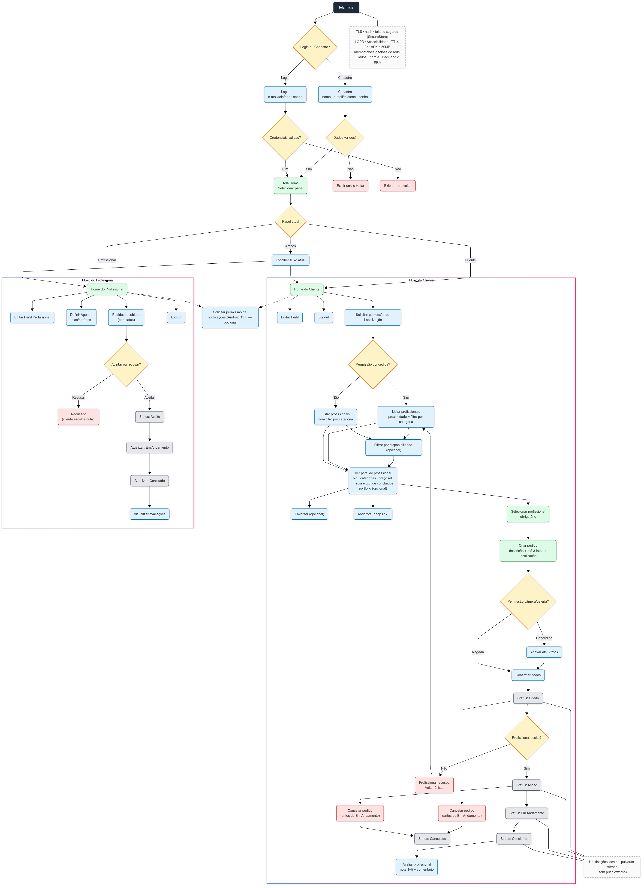
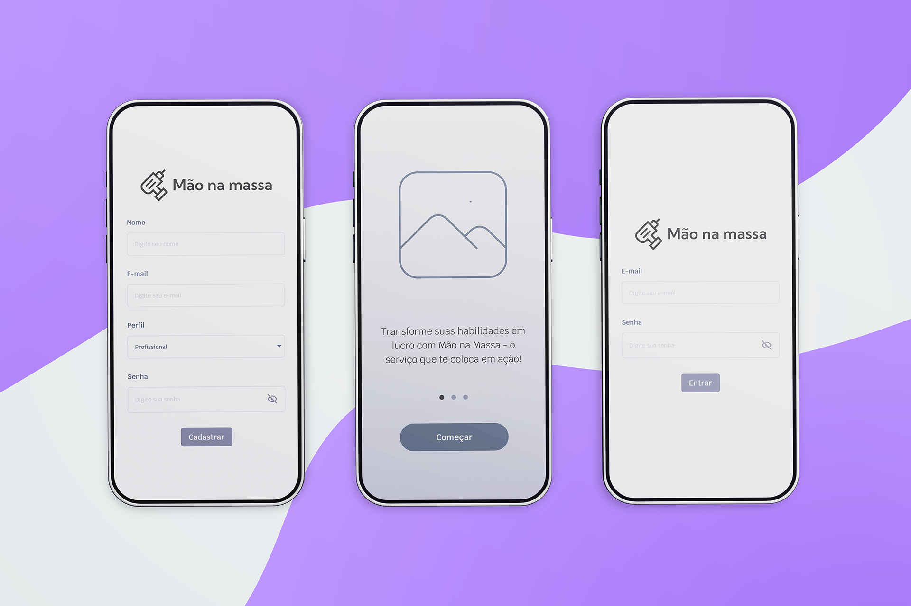
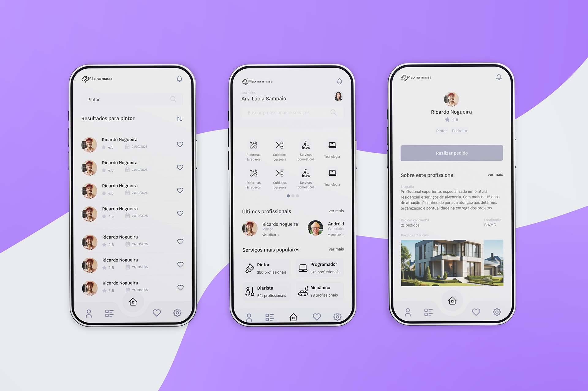
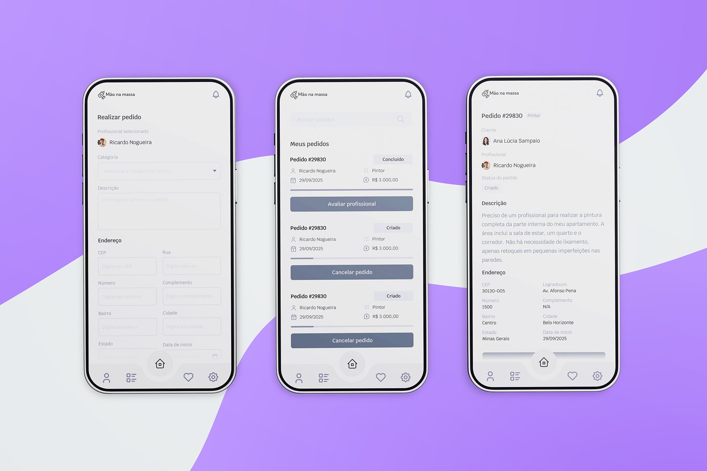
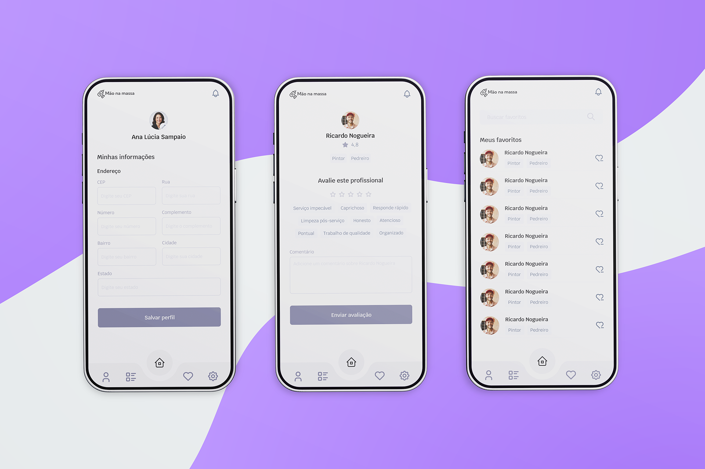
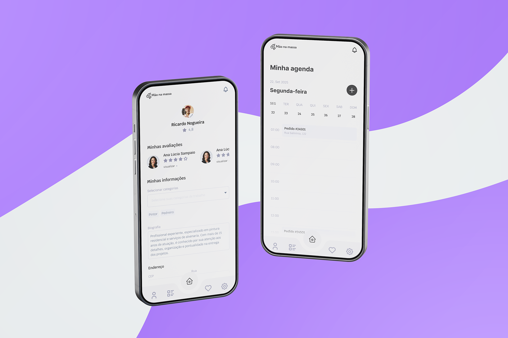

# Projeto de Interface

A navegação do usuário é organizada em fluxos distintos para **clientes** e **profissionais**, a partir da **tela inicial** de login/cadastro.

### Fluxo resumido:

- **Login/Cadastro** → acesso ao sistema.
- **Home Page** → escolha do perfil (Cliente/Profissional).
- **Cliente**: busca de profissionais → seleção → solicitação de serviço → acompanhamento do pedido → avaliação.
- **Profissional**: configuração de perfil e disponibilidade → recebimento de pedidos → confirmação/cancelamento → execução → avaliação.

---

## Interfaces Principais

### Tela Inicial (Boas-vindas)

- Elementos: botões Login e Cadastro.
- Atende: RF-001 (Cadastro), RF-002 (Login).
- Histórias: HU-01, HU-02.

### Cadastro / Login

- Cadastro: nome, e-mail/telefone, senha.
- Login: valida credenciais, mantém sessão e permite logout.
- Atende: RF-001, RF-002, RF-003.
- RNF: segurança (TLS, hash, armazenamento seguro de tokens – RNF-004), LGPD (RNF-006).

### Tela Home (Seleção de Papel)

- Elementos: escolher Cliente, Profissional ou Ambos.
- Atende: RF-005 (selecionar papel).
- Histórias: HU-03A (selecionar papel).

### Fluxo do Cliente

#### Permissões e Localização

- Elementos: microcopy para aceitar/recusar localização.
- Atende: RF-007 (capturar localização).
- RNF: permissões claras (RNF-005).

#### Listagem de Profissionais

- Elementos: lista por proximidade (se localização aceita) e filtro por categoria.
- Atende: RF-008 (listar + filtro).
- Histórias: HU-04.
- Opcional (Could): Filtro por disponibilidade (RF-022, HU-14).

#### Perfil do Profissional

- Elementos: bio, categorias, preço de referência, média de avaliações, quantidade de concluídos (histórico resumido), fotos do portfólio (opcional).
- Atende: RF-020 (histórico resumido), RF-021 (portfólio – opcional).
- Histórias: HU-12, HU-13.

#### Selecionar Profissional (obrigatório)

- Ação: escolher um profissional antes de criar o pedido.
- Atende: RF-009.
- Histórias: HU-05.

#### Criar Pedido

- Elementos: descrição, até 3 fotos (câmera/galeria), localização.
- Atende: RF-011.
- Histórias: HU-06.
- RNF: permissões de câmera/galeria (RNF-005).

#### Acompanhar / Cancelar Pedido

- Elementos: status Criado → Aceito → Em Andamento → Concluído / Cancelado; Cancelar permitido antes de “Em Andamento”.
- Atende: RF-012 (fluxo), RF-016 (cancelamento), RF-013 (pull/auto-refresh – sem push externo).
- Histórias: HU-07.

#### Avaliar Profissional

- Elementos: nota (1–5) + comentário após conclusão.
- Atende: RF-014.
- Histórias: HU-08.

#### Abrir Rotas (Mapas)

- Ação: deep link para o app de mapas do dispositivo.
- Atende: RF-010.
- Histórias: HU-16.

#### Favoritos e Categorias (opcionais)

- Favoritos: marcar profissional para recontratar rapidamente. Atende: RF-018 (HU-10).
- Categorias na Home: atalho por categoria. Atende: RF-019 (HU-11).

### Fluxo do Profissional

#### Perfil do Profissional

- Elementos: editar bio, categorias, preço de referência, fotos do portfólio (opcional).
- Atende: RF-006, RF-021 (opcional).
- Histórias: HU-03, HU-13.

#### Agenda (Disponibilidade)

- Elementos: dias/horários de trabalho.
- Atende: RF-017 (manter agenda).
- Histórias: HU-09.

#### Pedidos Recebidos

- Elementos: lista por status (Novos, Aceitos, Em Andamento, Concluídos/Cancelados).
- Ações: Aceitar/Recusar; Atualizar status para Em Andamento e Concluído.
- Atende: RF-012 (fluxo), RF-013 (pull/auto-refresh).
- Histórias: HU-07.
- Importante: Profissional não cancela pedido no MVP; ele recusa antes do aceite.

### Funcionalidades Comuns

#### Sessão e Notificações

- Logout: RF-003.
- Notificações locais (badges/banners dentro do app): RF-023 (HU-15).
- Atualização sem push: pull/auto-refresh (RF-013).

#### Qualidade (RNFs transversais)

- Desempenho: TTI ≤ 3s na Home (RNF-002).
- UI mobile: fluida, adaptada a densidades/tamanhos, lazy-load de imagens (RNF-009).
- Acessibilidade básica: textos escaláveis, contraste, rótulos (RNF-010).
- Segurança e privacidade: TLS, hash, tokens seguros (RNF-004), LGPD básico (RNF-006).

---

## Como o Design Atende às Especificações

- ### Cobertura de Requisitos Funcionais (RF) no fluxo principal

  - Seleção de papel (Cliente/Profissional/Ambos) conduz o menu da Tela Home (RF-005).
  - Descoberta e decisão: lista de profissionais por proximidade (se a permissão de localização for aceita) e filtro por categoria (RF-007, RF-008); perfil exibe bio, preço de referência, média de avaliações e concluídos (histórico resumido) e portfólio (opcional) (RF-020, RF-021).
  - Regra central: o Cliente deve selecionar um profissional antes de criar o pedido (RF-009).
  - Criação do pedido: descrição + até 3 fotos (câmera/galeria) + localização (RF-011); status: Criado → Aceito → Em Andamento → Concluído/Cancelado (RF-012); atualização por pull/auto-refresh (RF-013); cancelar permitido apenas antes de “Em Andamento” (RF-016).
  - Pós-serviço: avaliação 1–5 + comentário (RF-014); abrir rota via deep link para o app de mapas do dispositivo (RF-010).
  - Valor agregado opcional (Could): favoritos e categorias na Home; filtro por disponibilidade baseado na agenda do profissional (RF-018, RF-019, RF-017, RF-022).

- ### Qualidade e Não Funcionais (RNF) — mobile-first

  - Desempenho: Tempo até a Home ≤ 3s em aparelho de referência (RNF-002); listas com rolagem fluida e lazy-load de imagens (RNF-009).
  - Segurança & privacidade: todo tráfego em TLS; senhas com hash seguro; tokens em armazenamento seguro (ex.: Expo SecureStore) (RNF-004); LGPD básico (coleta mínima, consentimento, política de privacidade) (RNF-006).
  - Permissões claras: telas de onboarding/microcopy explicam impacto de negar localização (perde ordenação por proximidade) e câmera/galeria (não envia fotos) (RNF-005).
  - Confiabilidade: idempotência para criar/atualizar pedidos e tratamento de erro de rede com reenvio/backoff (RNF-008).
  - Tamanho e eficiência: objetivo de APK ≤ 80MB (RNF-003); compressão de imagens e moderação de reintentos para economia de dados/energia (RNF-011).
  - Disponibilidade: alvo de ≥ 99% para o back-end no período acadêmico (RNF-012).
  - Acessibilidade: textos escaláveis, contraste adequado e rótulos acessíveis; alvos de toque confortáveis (RNF-010).

- ### Padrões de navegação e microinterações (mobile)

  - Navegação por tabs/stack; feedback imediato em ações críticas (toasts/snackbars); estados vazios com chamadas para ação; skeletons e loaders consistentes.
  - Notificações locais (badges/banners dentro do app) para mudanças de status quando o app está aberto; sem push externo no MVP (RF-023).

- ### Alinhamento com Personas

  - Maria (simplicidade/segurança): fluxos curtos, linguagem clara, passos guiados, avaliações visíveis.
  - João (praticidade): busca por proximidade, abrir rota, favoritos (opcional) e status sempre à mão.
  - Ana Paula (profissional): perfil claro, agenda simples de manter, reputação via avaliações.
  - Carlos e Fernanda (gestão/recorrência): histórico resumido e recontratação ágil (favoritos – opcional).

- ### Escopo do MVP (o que o design não promete)

  - Sem pagamentos integrados, sem chat em tempo real, sem push externo (FCM/APNs), sem KYC/biometria e sem versão web nesta fase — o design não expõe fluxos, botões ou mensagens desses recursos.

---

## Diagrama de Fluxo

---

## Wireframes

Os wireframes a seguir descrevem a arquitetura de telas do aplicativo móvel Mão na Massa (Android, React Native/Expo). Eles priorizam clareza de navegação, pedidos orientados a status e a regra central do MVP: o cliente seleciona o profissional antes de criar o pedido (RF-009). Para navegação entre áreas principais recomenda-se Bottom Navigation (3–5 destinos de topo), que é o padrão indicado para apps mobile por equilibrar rapidez e previsibilidade.

#### Observações gerais (aplicáveis a todas as telas)

- Permissões no momento de uso (ex.: localização e notificações) — solicitar em contexto, quando a funcionalidade for acionada, em vez de pedir tudo na abertura do app. Isso melhora aceitação e entendimento pelo usuário.
- Notificações (Android 13+) — pedir a permissão POST_NOTIFICATIONS apenas quando houver valor percebido (ex.: ao acompanhar um pedido). O Android 13 mudou para opt-in em tempo de execução.
- Listas e cartões — a listagem de profissionais/pedidos deve usar lists e/ou cards para leitura rápida e ações contextuais.
- Onboarding curto — evitar tutoriais longos; priorizar levar o usuário direto ao primeiro valor do app, usando no máximo alguns painéis objetivos.

### Onboarding, Cadastro e Login

Objetivo: apresentar a proposta do app e levar rapidamente ao primeiro uso.

- Splash + boas-vindas (opcional, breve).
- Cadastro/Entrada (RF-001, RF-002): e-mail/telefone e senha; link para redefinir senha.
- Segurança/Privacidade: políticas resumidas e consentimentos (RNF-004, RNF-006).
- Permissões: não solicitar nada aqui; pedir depois, quando o usuário acionar a funcionalidade (ex.: localização na busca).

### Home (cliente), Busca e Perfil

Home do Cliente (RF-005): escolhe “Cliente” ou “Profissional” e apresenta atalhos para Buscar profissionais e Meus pedidos.

Busca/Listagem de Profissionais (RF-007, RF-008):

- Filtro por categoria e proximidade (lista com foto, nome, categoria, distância/avalição).
- Ao tocar em um item, abre o Perfil do Profissional.

Perfil do Profissional (RF-006, RF-021, RF-020 – opcionais): biografia, categorias, preço de referência, histórico/portfólio e avaliações.

### Realizar pedido, Pedidos do cliente e Detalhe de pedidos

Objetivo: guiar o cliente desde a solicitação até a conclusão do serviço.

Fluxo principal (MVP)

1. Selecionar profissional (obrigatório).
2. Criar pedido (RF-011): descrição, até 3 fotos, localização. Solicitar permissão de localização agora, pois é o momento de uso.
3. Status do pedido (RF-012, RF-013): Criado → Aceito → Em Andamento → Concluído.
4. Cancelar (RF-016): permitido somente antes de “Em Andamento” — indicar claramente no UI.
5. Notificações locais (RF-023 – opcional): informar mudanças de status; se desejar usar push no futuro, considerar a permissão de notificações (Android 13+).

### Editar perfil (cliente), Avaliar profissional e Lista de favoritos

- Editar Perfil (RF-004): dados pessoais e contatos.
- Avaliar Profissional (RF-014): nota + comentários (após “Concluído”).
- Favoritos (RF-018 – opcional): recontratação rápida.

### Home (profissional), Lista de pedidos do profissional e Atualização de status

- Home do Profissional: visão da agenda do dia e pedidos pendentes.
- Disponibilidade (RF-017, RF-022 – opcional): dias/horários de trabalho.
- Pedidos recebidos: Aceitar/Recusar (RF-012); depois Atualizar status para Em Andamento / Concluído (RF-013).
- Listagem por status (opcional): melhora o controle operacional.

### Editar perfil (profissional) e Agenda

- Perfil de serviços (RF-006): biografia, categorias, preço de referência, contatos/endereço.
- Agenda (RF-017): definição/edição de dias e horários disponíveis.

### Mapa de rastreabilidade (telas → requisitos)

|                **Tela/Bloco**                 |                                          **RF/RNF cobertos**                                          |
| :-------------------------------------------: | :---------------------------------------------------------------------------------------------------: |
|         Onboarding, Cadastro e Login          |                               RF-001, RF-002, RF-003; RNF-004, RNF-006                                |
|                Home (cliente)                 |                                                RF-005                                                 |
| Buscar profissionais / Perfil do profissional |                       RF-007, RF-008, RF-006 (perfil), RF-021/-020 (opcionais)                        |
|       Criar pedido / Detalhe do pedido        | RF-009, RF-011, RF-012, RF-013, RF-016, RF-023 (opcional); RNF-005 (permissões), RNF-002 (desempenho) |
|            Meus pedidos (cliente)             |                                            RF-012, RF-013                                             |
|             Avaliar profissional              |                                                RF-014                                                 |
|                   Favoritos                   |                                           RF-018 (opcional)                                           |
|    Home (profissional) / Pedidos recebidos    |                                            RF-012, RF-013                                             |
|                Disponibilidade                |                                RF-017 (e RF-022 como filtro opcional)                                 |
|     Editar perfil (cliente/profissional)      |                                            RF-004, RF-006                                             |

### Inventário de Telas

Abaixo está o Inventário de Telas para o app mobile Mão na Massa. Ele segue boas práticas de navegação em apps (destinos de topo no Bottom Navigation, 3–5 itens) e pede permissões em contexto (ex.: localização e notificações só quando o usuário aciona a função). Isso melhora previsibilidade/velocidade da navegação e adesão às permissões no Android 13+.

| **Identificador** |               **Tela**               |                     **Objetivo**                     |                                **Principais elementos/ações**                                 |            **RF / HU atendidos**            |                                           **Observações (permissões/UX)**                                           |
| :---------------: | :----------------------------------: | :--------------------------------------------------: | :-------------------------------------------------------------------------------------------: | :-----------------------------------------: | :-----------------------------------------------------------------------------------------------------------------: |
|       WF-01       |         Splash / Boas-vindas         |   Introduzir a marca e carregar recursos iniciais.   |                      Logotipo, mensagem curta, fallback de erro de rede.                      |                      –                      |                             Onboarding curto; leve o usuário rápido ao login/cadastro.                              |
|       WF-02       |               Cadastro               |       Criar conta com e-mail/telefone e senha.       |        Formulário (nome, e-mail/telefone, senha), link para login, termos/privacidade.        |          RF-001, RNF-004, RNF-006           |                   Evitar pedir permissões aqui; peça quando a função for usada. (Material Design)                   |
|       WF-03       |             Login / Sair             |             Autenticar e manter sessão.              |                      Campos, “esqueci senha”, botão Entrar, ação Logout.                      |           RF-002, RF-003, RNF-004           |                       Mensagens claras em credenciais inválidas; evitar bloqueios genéricos.                        |
|       WF-04       |            Escolher Papel            |            Definir como o app será usado.            |                           Botões: Cliente, Profissional (e Ambos).                            |                   RF-005                    |                               Persistir escolha localmente; permitir troca no Perfil.                               |
|       WF-05       |           Home do Cliente            |           Atalhos para o fluxo principal.            |    Ações: Buscar profissionais, Meus pedidos, Perfil. Bottom Navigation com 3–4 destinos.     |               RF-005, RF-012                |                     Destinos de topo no bottom nav melhoram acesso rápido. (Android Developers)                     |
|       WF-06       |         Buscar Profissionais         | Encontrar profissionais por proximidade e categoria. |           Busca por categoria, lista/cards com nome, foto, distância/nota; filtro.            |         RF-007, RF-008; HU de busca         |                       Solicitar localização ao abrir a busca (em contexto). (Material Design)                       |
|       WF-07       |        Perfil do Profissional        |        Analisar detalhes antes de contratar.         |       Bio, categorias, preço de referência, avaliações; Portfólio/Histórico (opcional).       |          RF-006, RF-021/020 (opc.)          |                           Exibir botão Selecionar profissional (pré-requisito do pedido).                           |
|       WF-08       |       Selecionar Profissional        |          Confirmar quem atenderá o pedido.           |                     Confirmação com resumo do perfil e CTA Criar pedido.                      |                   RF-009                    |                                       Reforçar que sem seleção não há pedido.                                       |
|       WF-09       |             Criar Pedido             |               Registrar a solicitação.               |                    Descrição, até 3 fotos, endereço/geo (mapa), data/hora.                    |                   RF-011                    |                        Pedir permissão de localização aqui (quando usada). (Material Design)                        |
|       WF-10       |        Meus Pedidos (Cliente)        |         Acompanhar solicitações por status.          | Abas ou filtros: Criado, Aceito, Em Andamento, Concluído, Cancelado; cards com ações rápidas. |               RF-012, RF-013                |                         Use lists/cards para leitura e ações contextuais. (Material Design)                         |
|       WF-11       |     Detalhe do Pedido (Cliente)      |       Ver detalhes e Cancelar quando possível.       |              Resumo, status atual, timeline; botão Cancelar (se < Em Andamento).              |               RF-012, RF-016                |                              Regras de negócio claras sobre a janela de cancelamento.                               |
|       WF-12       |         Avaliar Profissional         |               Avaliar após conclusão.                |                              Nota (1–5), comentário; CTA Enviar.                              |                   RF-014                    |                                     Acessível via Detalhe do Pedido concluído.                                      |
|       WF-13       |         Favoritos (opcional)         |                Recontratação rápida.                 |                     Lista de profissionais salvos; remover/abrir perfil.                      |                   RF-018                    |                                       Pode ficar fora do MVP se faltar tempo.                                       |
|       WF-14       |         Home do Profissional         |           Resumo do dia e acesso à agenda.           |                Cards: Pedidos novos, Pendentes, Hoje; atalho Disponibilidade.                 |               RF-012, RF-017                |                                                                                                                     |
|       WF-15       |    Pedidos Recebidos / por Status    |            Aceitar/recusar e acompanhar.             |            Listas por status; card com ações Aceitar / Recusar / Atualizar status.            |               RF-012, RF-013                |                                                                                                                     |
|       WF-16       |   Atualizar Status (Profissional)    |           Marcar Em Andamento / Concluído.           |                       Seleção de status, notas opcionais, confirmação.                        |                   RF-013                    | Pode gerar notificação local ao cliente (opcional). Android 13 exige opt-in para notificações. (Android Developers) |
|       WF-17       |   Disponibilidade (dias/horários)    |          Organizar agenda do profissional.           |                          Semana/dias, intervalos de horário, salvar.                          | RF-017; RF-022 (filtro opcional no cliente) |                                                                                                                     |
|       WF-18       | Editar Perfil (Usuário/Profissional) |              Manter dados atualizados.               |            Nome, foto, contatos; no modo Profissional: bio, categorias, preço ref.            |               RF-004, RF-006                |                                                                                                                     |
