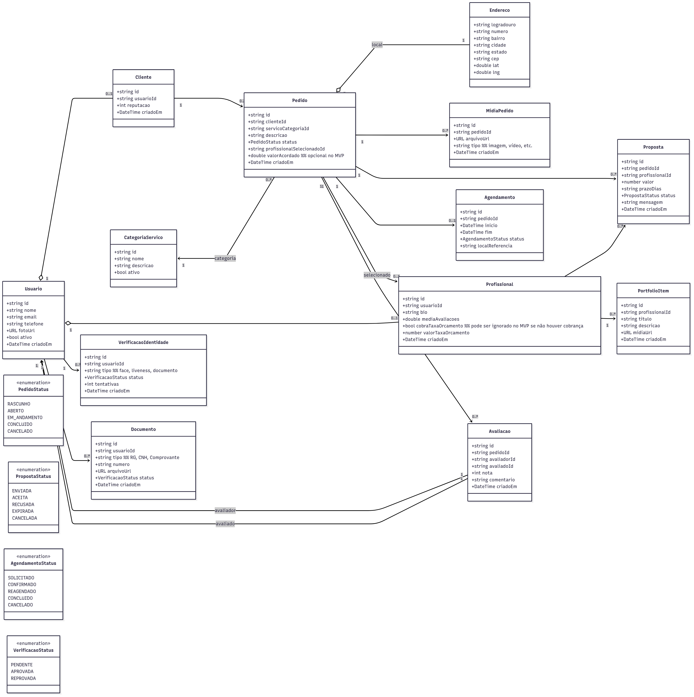
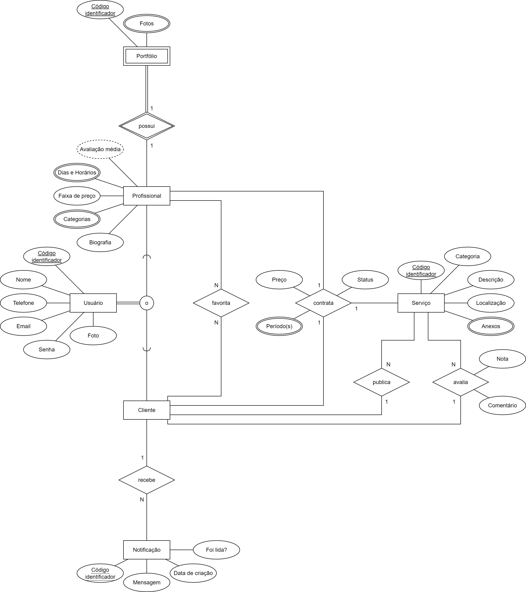
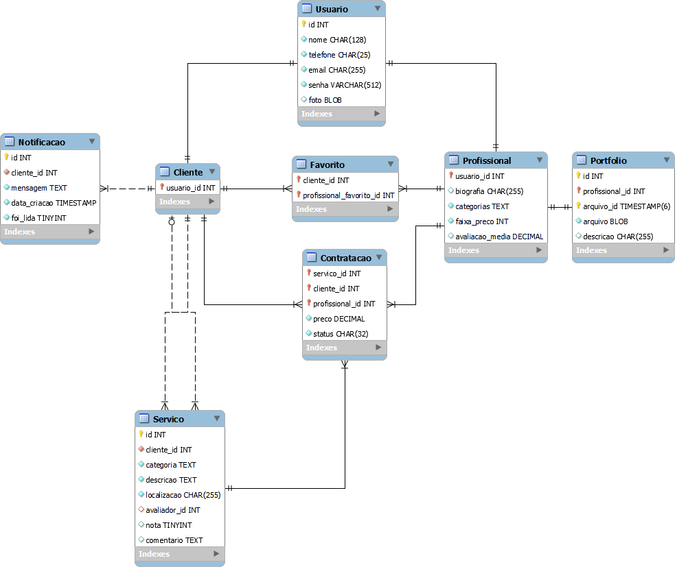
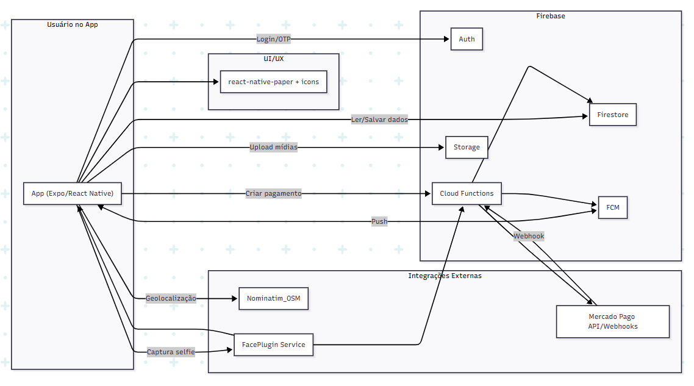

# Arquitetura da Solução

Este documento apresenta a arquitetura de referência do Mão na Massa (aplicativo móvel) e transforma a visão de produto em um blueprint técnico que orienta construção, evolução e operação do sistema. Descrevemos como os componentes se organizam e se comunicam — do cliente móvel ao backend e serviços de dados — para atender aos requisitos funcionais e não funcionais definidos na Especificação do Projeto e garantir um MVP viável, seguro e demonstrável.

#### Escopo (MVP)

A arquitetura cobre:

- Aplicativo móvel Android (React Native + Expo), adotando navegação e componentes nativos, acessibilidade e desempenho compatíveis com o contexto mobile;
- BaaS Firebase para acelerar o time-to-market: Auth (e-mail/senha), Firestore (dados do domínio) e Storage (imagens dos pedidos). Cloud Functions poderão ser utilizadas de forma pontual para lógica de backend (opcional);
- Geolocalização e mapas via Expo Location e OpenStreetMap/Nominatim/MapLibre para consulta, exibição de mapa e cálculo de coordenadas;
- Notificações locais no dispositivo para eventos do fluxo de pedidos (sem push externo);
- Publicação e distribuição do app Android via EAS Build (APK) e Google Play quando aplicável.

#### Fora do escopo do MVP (evolução futura)

Integrações de pagamentos on-line (ex.: Mercado Pago), notificações push externas (FCM), biometria/KYC (ex.: FacePlugin) e versão iOS/web. Esses itens permanecem planejados para fases posteriores, após a validação do MVP.

#### Objetivo

Fornecer um modelo claro e consistente para que todo o time (desenvolvimento, QA, design e produto) tome decisões alinhadas, reduza retrabalho e mantenha a qualidade ao longo do ciclo de vida — desenvolvimento, testes, publicação e operação — com limites explícitos do MVP e um caminho de evolução controlado (escalabilidade, segurança e custo) para iterações futuras.

## Diagrama de Classes

Abaixo temos o Diagrama de Classes do sistema Mão na Massa, incluindo entidades de domínio importantes como Usuário, Cliente, Profissional, Pedidos, Propostas, Agendamento, Revisões, Portfólios e Verificação de Identidade, juntamente com seus relacionamentos e enumerações.

## Diagrama de Entidade-Relacionamento (DER)

Abaixo temos o Diagrama de Entidade-Relacionamento (DER) do sistema Mão na Massa, ilustrando as entidades, seus atributos e os relacionamentos entre elas. Definindo interações importantes como, por exemplo, a criação, contratação e avaliação de serviços.

## Esquema Relacional

O Esquema Relacional é o mapeamento do DER em tabelas relacionais, que serão implementadas no banco de dados. Abaixo temos a figura desse esquema detalhando as tabelas, suas colunas e os relacionamentos.

## Modelo Físico

No modelo físico já temos a implementação do Esquema Relacional em SQL, com a definição das tabelas, colunas, tipos de dados, restrições e índices necessários para garantir a integridade e eficiência do banco de dados. Abaixo temos links diretos para cada um desses scripts SQL, mais especificamente do SGBD MySQL, que podem ser encontrados na pasta [`/src/database/DDL/`](../src/database/DDL/).

- [Criação das Tabelas: `tables.sql`](../src/database/DDL/tables.sql);
- [Criação das Restrições: `constraints.sql`](../src/database/DDL/constraints.sql);
- [Criação dos Índices: `indexes.sql`](../src/database/DDL/indexes.sql).

## Tecnologias Utilizadas

A seguir, descrevemos as tecnologias adotadas para implementar o Mão na Massa (mobile), cobrindo linguagens, frameworks, SDKs, serviços cloud, integrações externas, ferramentas de desenvolvimento/QA, além de um diagrama que mostra como elas se relacionam ao longo do fluxo de uso — do toque do usuário até a resposta no app.

### Visão geral (matriz tecnologia × finalidade)

|        **Camada**        |                              **Tecnologia**                             |                                         **Finalidade**                                        |
|:------------------------:|:-----------------------------------------------------------------------:|:---------------------------------------------------------------------------------------------:|
|        App Mobile        |            React Native (Expo) – React 19, RN 0.79, Expo ~53            |     Base do aplicativo mobile (Android/iOS) com fluxo de desenvolvimento rápido via Expo.     |
|     UI/Design System     |                  react-native-paper, @expo/vector-icons                 |            Componentes acessíveis e padronizados (botões, inputs, cards) + ícones.            |
|         Linguagem        |                              JavaScript/JSX                             |                             Lógica de UI e integrações no cliente.                            |
|  Geolocalização & Mapas  | Expo Location, MapLibre/React Native Maps com tiles OpenStreetMap (OSM) |                       Obtenção de localização, exibição de mapa e rotas.                      |
|      Geocodificação      |                             Nominatim (OSM)                             |                 Conversão de coordenadas ↔ endereços para orçamentos e agenda.                |
|       Autenticação       |           Firebase Authentication (WhatsApp/SMS OTP como 2FA)           |                Login/registro, validação de dispositivo, recuperação de conta.                |
|      Backend (BaaS)      |         Firebase: Cloud Firestore, Cloud Functions, Storage, FCM        |   Banco NoSQL, lógica serverless, armazenamento de mídias (portfólios), push notifications.   |
|        Pagamentos        |              Mercado Pago (Checkout/Wallet/Pix) + Webhooks              |        Criação de preferências, cobrança segura, conciliação via webhooks (Functions).        |
| Antifraude (biometria)** |                FacePlugin Face Recognition & Liveness SDK               | Verificação de identidade e prova de vida nas ações críticas (onboarding, saques, portfólio). |
|      Observabilidade     |         Firebase Crashlytics & Analytics, Performance Monitoring        |                           Erros, métricas de uso, latências no app.                           |
|         Segurança        |              Firebase Security Rules, App Check, HTTPS/TLS              |                Proteção a dados, validação de origem, criptografia em trânsito.               |
|    CI/CD & Publicação    | EAS (Expo Application Services), Google Play Console, App Store Connect |             Build, assinatura, distribuição e atualizações OTA (quando aplicável).            |
|     Dev & Colaboração    |                   VS Code, Git/GitHub, GitHub Actions                   |                                 IDE, versionamento, pipelines.                                |
|          Design          |                                  Figma                                  |                          Protótipos navegáveis, tokens e specs de UI.                         |
|         Qualidade        |             Jest + React Testing Library, ESLint + Prettier             |                    Testes de unidade/integração, lint/style e padronização.                   |

### Detalhamento por domínio funcional

#### 1) Autenticação & Identidade

- Firebase Auth (e-mail/senha, phone/OTP; fatores adicionais via WhatsApp/SMS).
- FacePlugin: validação biométrica (liveness) nos pontos críticos: criação de conta, atualização de dados sensíveis, primeira solicitação de serviço, publicação de portfólio, saques/conta bancária (futuro), login em dispositivo novo, exclusão de conta.

#### 2) Catálogo, Orçamentos, Pedidos e Agenda

- Cloud Firestore: entidades de usuários, perfis (cliente/profissional/ambos), serviços, propostas, pedidos, agenda, avaliações.
- Cloud Functions (Node.js): orquestração de regras de negócio (ex.: status de pedido, cálculo de taxas, normalização de dados), webhooks e integrações externas.
- Storage: mídias do portfólio profissional e anexos (com validação de tipo/tamanho).

#### 3) Pagamentos e Conciliação

- Mercado Pago (Checkout/Wallet/Pix): criação de preferências pelo backend (Functions); retorno via webhooks para registrar pagamento/estornos; atualização de status do pedido no Firestore; notificação ao app via FCM.

#### 4) Geolocalização e Endereços

- Expo Location para permissões e coordenadas.
- MapLibre/React Native Maps com OpenStreetMap para render de mapas.
- Nominatim (OSM) para geocodificação/reverso (endereços human-readable em orçamentos e rotas).

#### 5) Notificações e Mensageria

- Firebase Cloud Messaging (FCM) para push (mudança de status, novas propostas, lembretes de agenda).
- Cloud Functions para disparo de notificações baseado em eventos de domínio (ex.: proposta recebida).

#### 6) Observabilidade, Segurança e Compliance

- Crashlytics/Analytics/Performance para saúde do app, jornadas e KPIs de produto.
- Security Rules (Firestore/Storage) e App Check para proteger acesso indevido.
- Configuração de CORS e rate limit em Functions quando expostas.
- Criptografia em trânsito (HTTPS/TLS); segregação de ambientes (dev/staging/prod).

#### 7) Dev Experience, CI/CD e Publicação

- Expo + EAS: builds gerenciados, perfis de build por ambiente, OTA quando aplicável.
- GitHub Actions: testes, lint, builds automatizados.
- VS Code, ESLint, Prettier: produtividade e padronização.
- Figma: handoff de design e componentes reutilizáveis (com react-native-paper).

#### Leitura do fluxo (simplificada):

1. O usuário interage com a UI do app (react-native-paper).
2. A autenticação passa por Firebase Auth (com OTP/WhatsApp/SMS quando aplicável).
3. Dados de negócio vivem no Firestore; mídias vão para Storage.
4. Lógica sensível e integrações acontecem em Cloud Functions.
5. Pagamentos são criados no backend; Mercado Pago notifica via webhooks → Functions atualiza Firestore e dispara FCM.
6. FacePlugin executa biometria/liveness; o resultado alimenta regras no backend.
7. Geolocalização e endereços são obtidos via Expo Location + Nominatim/OSM.

### Justificativa da pilha

- Tempo de mercado (MVP): React Native + Expo + Firebase entregam alto time-to-value com menor carga operacional.
- Escalabilidade e custo: BaaS serverless reduz overhead inicial; paga-se por uso.
- Confiabilidade e segurança: Auth, Rules, App Check e webhooks desacoplados; antifraude biométrico nos pontos críticos.
- Experiência do usuário: UI consistente, push em tempo real, pagamentos populares (Pix/Cartão via Mercado Pago) e localização integrada.

## Hospedagem

A aplicação será publicada utilizando o **Expo** e integrada com o **GitHub** para garantir controle de versão e automação do processo de deploy.  
- **Front-end (React Native/Expo):** será disponibilizado pelo Expo, que gera versões de teste e de produção para Android e iOS.  
- **Back-end (APIs e Banco de Dados):** o back-end será hospedado em um serviço de nuvem (Railway, Render ou Heroku), conectado a um banco de dados **MySQL**.  
- **Banco de Dados:** o **MySQL Workbench** será usado para modelagem e administração, e o banco ficará hospedado em um provedor de nuvem compatível.  

### Fluxo de Deploy
1. **Versionamento no GitHub**  
   - O código é mantido no repositório principal.  
   - Branch `main` será a referência para produção.  

2. **Integração com a hospedagem**  
   - O serviço de nuvem será conectado ao repositório GitHub.  
   - A cada alteração validada no `main`, o sistema dispara um **build automático**.  

3. **Distribuição do App com Expo**  
   - Versão de testes: criada via **Expo Go**, permitindo que a equipe valide as funcionalidades em tempo real.  
   - Versão de produção: gerada pelo **EAS Build (Expo Application Services)** para gerar os arquivos finais (`.apk` para Android e `.ipa` para iOS).  

### Configuração de Banco de Dados
- O **MySQL Workbench** será utilizado para modelagem e migrações.  
- Variáveis de ambiente serão configuradas no servidor (`DB_HOST`, `DB_USER`, `DB_PASSWORD`, `DB_NAME`).  
- O banco em nuvem garante acesso remoto seguro para integração com o back-end.  

### Monitoramento e Manutenção
- **Logs de servidor** e de **APIs** serão monitorados por meio do provedor de hospedagem.  
- O Expo fornece relatórios de erros de execução nos aplicativos móveis.  
- Backups automáticos do banco de dados serão configurados.  

### Lançamento da Plataforma
1. **Ambiente de Testes (Staging):**  
   - Disponibilizado via Expo Go para a equipe interna.  
   - Banco de dados separado, usado para validação antes do lançamento oficial.  

2. **Ambiente de Produção:**  
   - Aplicativo publicado nas lojas oficiais (Google Play e App Store) através do **Expo EAS**.  
   - APIs e banco de dados rodando em ambiente escalável na nuvem.  

## Qualidade de Software

Conceituar qualidade de fato é uma tarefa complexa, mas ela pode ser vista como um método gerencial que através de procedimentos disseminados por toda a organização, busca garantir um produto final que satisfaça às expectativas dos stakeholders.

No contexto de desenvolvimento de software, qualidade pode ser entendida como um conjunto de características a serem satisfeitas, de modo que o produto de software atenda às necessidades de seus usuários. Entretanto, tal nível de satisfação nem sempre é alcançado de forma espontânea, devendo ser continuamente construído. Assim, a qualidade do produto depende fortemente do seu respectivo processo de desenvolvimento.

A norma internacional **ISO/IEC 25010**, que é uma atualização da ISO/IEC 9126, define oito características e 30 subcaracterísticas de qualidade para produtos de software.  
Com base nessas características e nas respectivas sub-características, identificamos as que nortearão o desenvolvimento do projeto **Mão na Massa**.  

Baseados no modelo **ISO/IEC 25010**:

- **Funcionalidade** → app deve permitir cadastro, busca, solicitação, gestão e avaliação de serviços.  
- **Confiabilidade** → pedidos registrados sem duplicidade e histórico preservado.  
- **Usabilidade** → interface simples para diferentes perfis (idosos, jovens, profissionais autônomos).  
- **Eficiência/Desempenho** → tempo de abertura ≤ 3s; listagem de profissionais ≤ 2s.  
- **Manutenibilidade** → código modular, versionamento em GitHub, documentação clara.  
- **Portabilidade** → compatível com navegadores modernos e Android ≥ 8.  
- **Compatibilidade** → integração com APIs de mapas e geolocalização.  
- **Segurança** → uso de TLS, autenticação segura e adequação à LGPD.  

### 1. Política e Estratégia de Qualidade
- **Padrões**: clean code, design system, convenções de nomenclatura.  
- **Metodologias**: TDD, integração contínua, code review obrigatório.  
- **Ferramentas**:  
  - SonarQube (análise de código).  
  - JUnit/Jest (testes unitários).  
  - Postman (testes de API).  
  - Cypress (testes end-to-end).  

### 2. Plano de Garantia da Qualidade (QA)
- **Prevenção**: revisão de requisitos e protótipos, critérios de aceitação.  
- **Verificação**: testes unitários, integração e regressão a cada sprint.  
- **Validação**: homologação com personas do projeto (Maria, João, Ana, Carlos, Fernanda).  
- **Critérios de Aceitação**:  
  - ≥ 95% dos testes automatizados devem passar.  
  - Nenhum bug crítico pode estar aberto na entrega.  

### 3. Plano de Testes
**Tipos de teste**:  
- Unitário (funções isoladas).  
- Integração (fluxo cliente-profissional).  
- Sistema (login → pedido → avaliação).  
- Aceitação (usuários reais validando histórias).  

**Automação**:  
- Unitários (JUnit/Jest).  
- API (Postman).  
- Funcionais críticos (Cypress).  
- Usabilidade (testes manuais).  

### 4. Métricas de Qualidade
| Métrica                       | Objetivo | Fórmula | Meta |
|-------------------------------|----------|---------|------|
| Cobertura de Testes           | Robustez | Linhas testadas ÷ total linhas | ≥ 80% |
| Taxa de Defeitos              | Reduzir falhas | Bugs ÷ módulos testados | ≤ 5% |
| Tempo Médio de Resposta       | Desempenho | Σ tempos ÷ nº requisições | ≤ 2s |
| MTBF (entre falhas)           | Confiabilidade | Horas operando ÷ nº falhas | ≥ 48h |
| Satisfação do Usuário (NPS)   | Usabilidade | Pesquisa com usuários | ≥ 8/10 |

### 5. Gerenciamento de Riscos
| Risco | Impacto | Mitigação |
|-------|---------|-----------|
| Baixa cobertura de testes | Falhas em produção | Priorizar automação |
| API externa indisponível | Interrupção de serviços | Fallback com cache/manual |
| Baixa adesão de usuários | Perda de valor do app | Usabilidade + validação com personas |

### 6. Relatórios e Auditoria
- **Periodicidade**: semanal (por sprint).  
- **Responsável**: equipe de QA e Product Owner.  
- **Formatos**: dashboards em CI/CD, planilhas de bugs, relatórios finais.  
