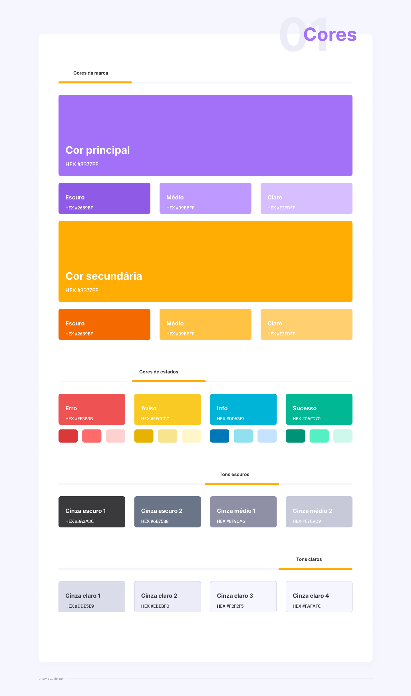
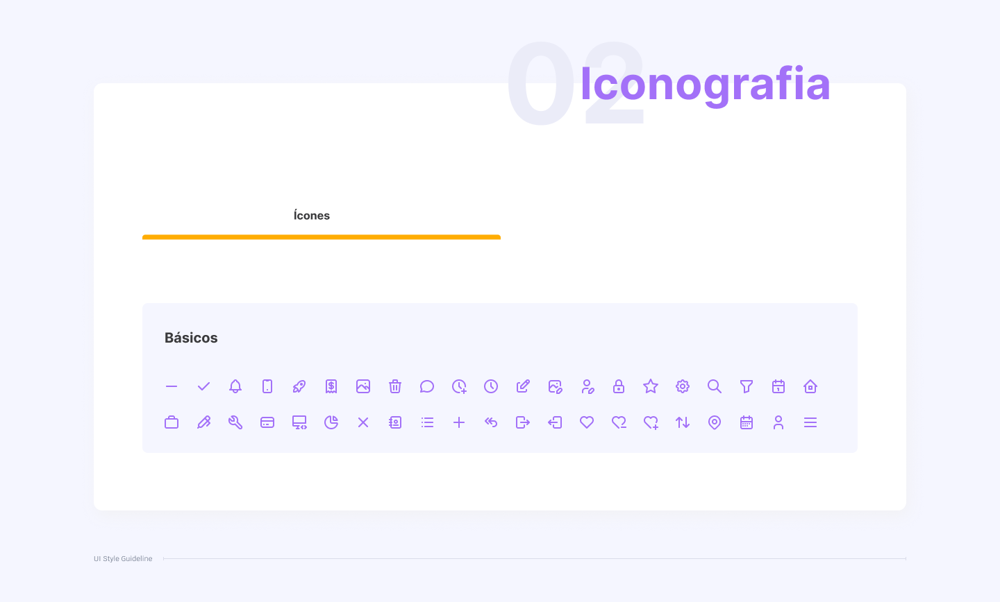
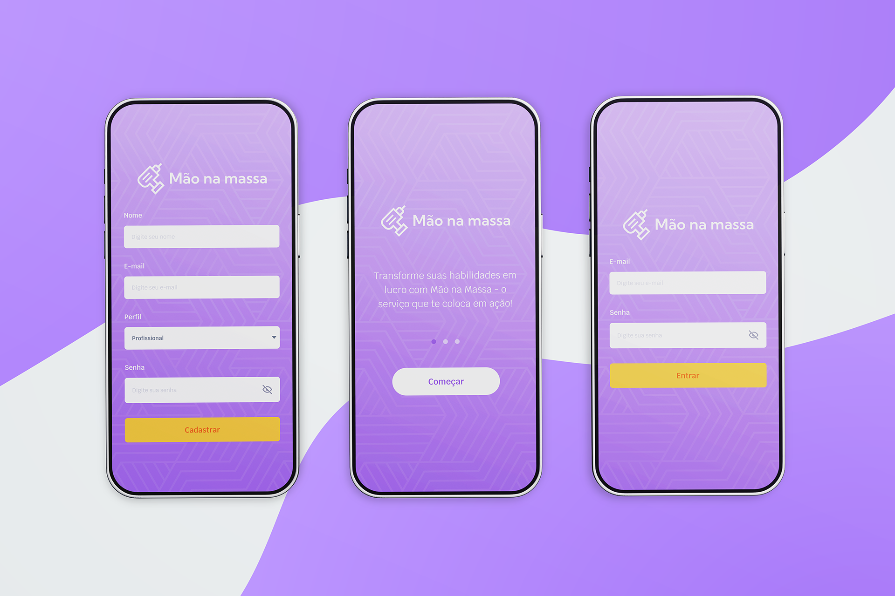
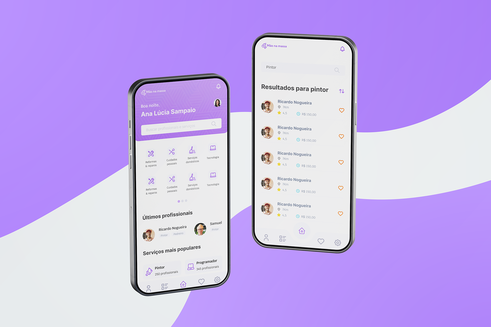
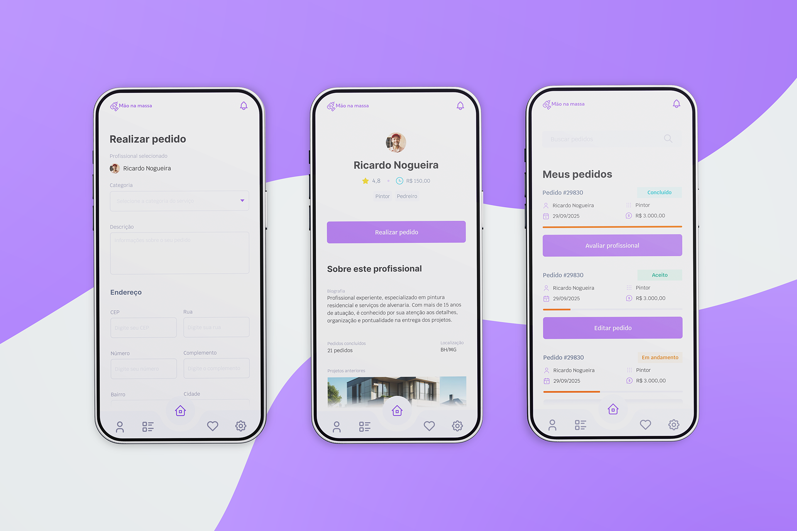
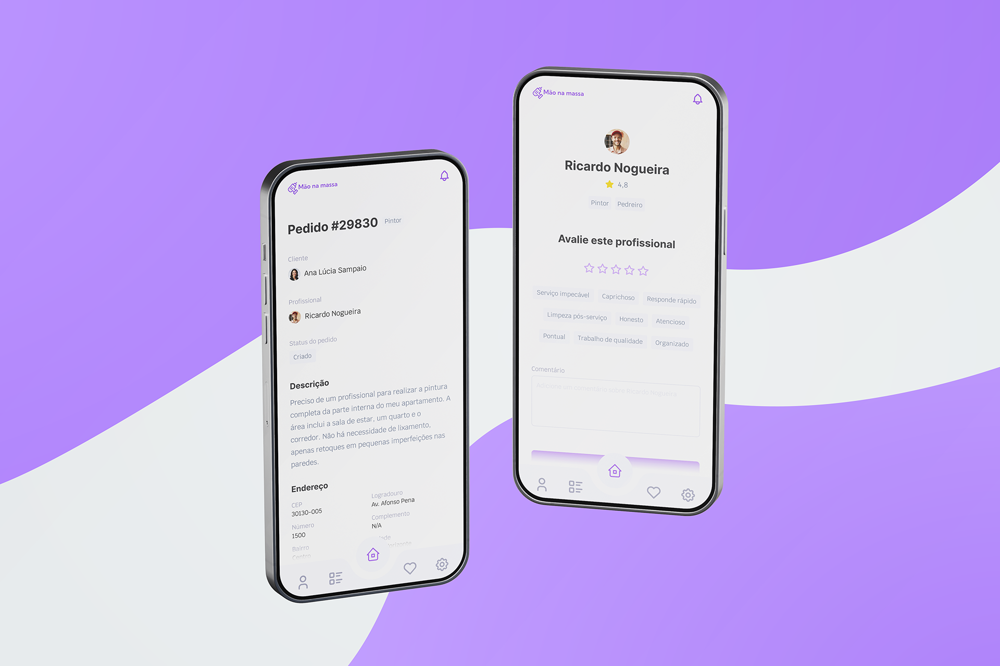
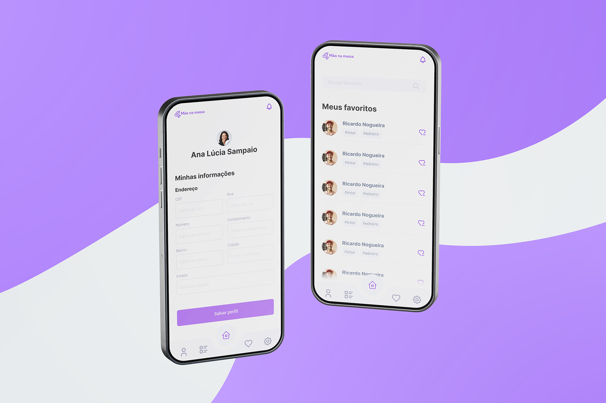
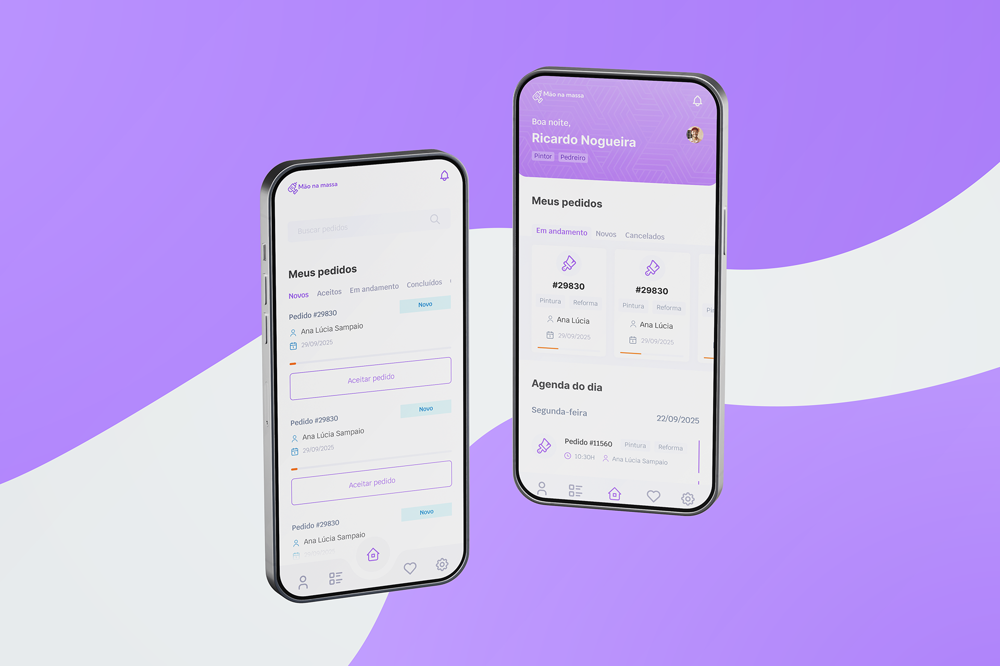
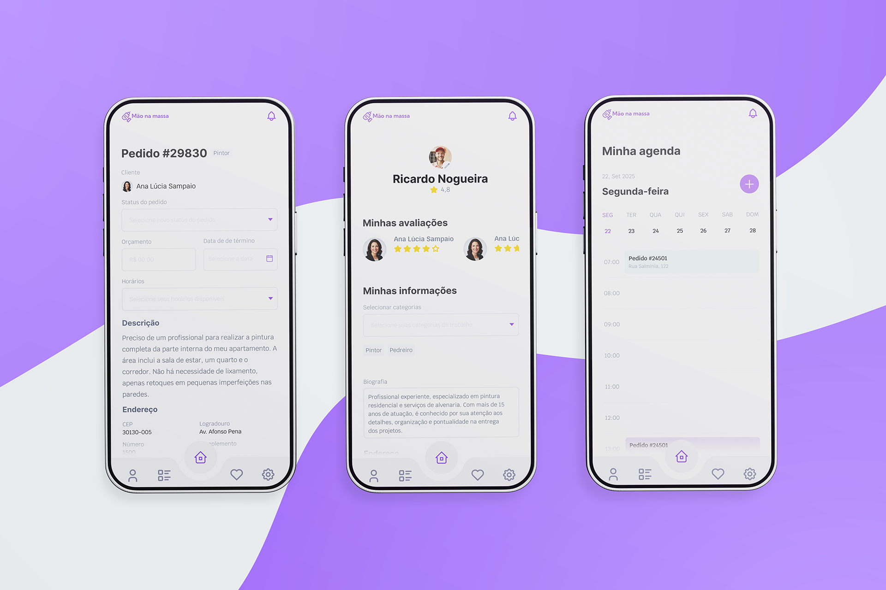

# Template Padrão da Aplicação

Criado para ser mais que um app, o Mão na Massa foi desenhado para ser uma experiência simples e confiável. Com um visual vibrante que combina o roxo da criatividade com a energia do laranja, cada tela foi pensada para ser intuitiva, segura e agradável aos olhos.

Nossa interface é sobre praticidade. Da navegação à interação, tudo foi feito para você encontrar o que precisa e resolver seus serviços com poucos toques. Nosso design é o elo entre a sua necessidade e o profissional certo, garantindo um processo transparente, rápido e, acima de tudo, humano.

O protótipo da aplicação e o layout e style guide podem ser acessados diretamente através do link abaixo:

[Layout Figma: Mão na Massa](https://www.figma.com/design/YxpMUZHBv3xYggttmLPpkv/M%C3%A3o-na-massa---style-guide?node-id=3482-2429&t=twujAHrL390yDZZz-1)

## Style guide

## Páginas de Onboarding, Cadastro e Login

## Home (cliente) e Busca

## Perfil (profissional), Realizar pedido e Lista de pedidos (cliente)

## Detalhe de pedido e Avaliar profissional

## Editar perfil (cliente) e Lista de favoritos

## Lista de pedidos (profissional) e Home (profissional)

## Alterar pedido, Editar perfil (profissional) e Agenda

